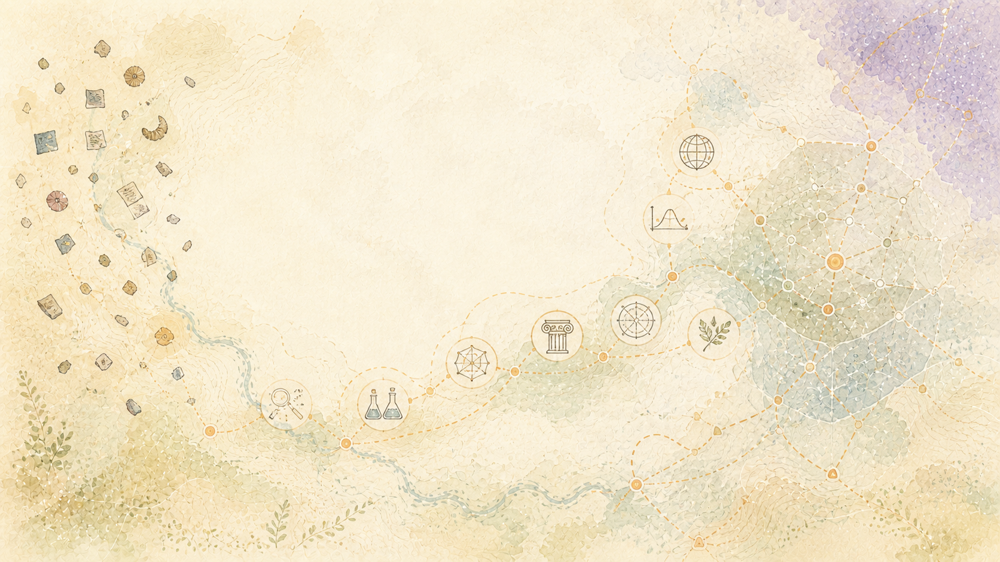

> বাংলা: অনুমোদিত ইংরেজি উৎসের মেশিন-সহায়তা অনুবাদ। স্থানীয়-ভাষা সংশোধন স্বাগত জানাই. [ইংরেজি](../../README.md) | [সব ভাষা](../README.md)

# কাজের পিছনে আইডিয়াস

## একটি মাল্টিডিসিপ্লিনারি সিস্টেম

স্থাপত্যটি একাধিক শাখার প্রক্রিয়াগুলিকে একত্রিত করে। এটি এই ক্ষেত্রগুলি আবিষ্কার করেছে বা উদ্ধৃত সম্প্রদায়গুলি এই বাস্তবায়নকে সমর্থন করে বলে দাবি করে না। এটির অবদান হল যেভাবে তাদের সীমাবদ্ধ ক্ষমতাগুলি বরাদ্দ করা হয়, পরিমাপ করা হয় এবং পৃথক প্রসঙ্গ সংরক্ষণের চারপাশে সংযুক্ত করা হয়।

## প্রধান গবেষণা বংশ

### উত্স, অস্থায়ী ডেটা এবং গ্রাফ

কন্টেন্ট অ্যাড্রেসিং, শুধুমাত্র-সংযোজন-পর্যবেক্ষণ ইতিহাস, সাময়িক বৈধতা, অধিগ্রহণ, টাইপ করা গ্রাফ সম্পর্ক, এবং ক্যোয়ারী-স্কোপড প্রজেকশন সংরক্ষণ সাবস্ট্রেট সরবরাহ করে। গ্রাফ অ্যালগরিদমগুলি নাগাল, কেন্দ্রীয়তা, ব্রিজিং এবং শাখার খরচ পরিমাপ করতে পারে, কিন্তু সেই মেট্রিকগুলি ব্যক্তিগত গুরুত্ব থেকে আলাদা থাকে।

### বক্তৃতা এবং তর্ক

অলঙ্কৃত কাঠামো তত্ত্ব বক্তৃতা সম্পর্ক এবং পারমাণবিক কাঠামো সরবরাহ করে। কোরফারেন্স পদ্ধতি প্রার্থীর রেফারেন্স চেইন সরবরাহ করে। যুক্তি-খনির কাজ সরবরাহ করে প্রস্তাব-জোড়া শ্রেণীবিভাগ। xAIF এবং সম্পর্কিত আর্গুমেন্ট ইন্টারচেঞ্জ ধারণাগুলি দ্বিতীয় সত্যের দোকান না হয়ে একটি দরকারী গ্রাফ শব্দভাণ্ডার প্রদান করে।

বাস্তবায়নে IsaNLP RST, FastCoref, AMF আর্গুমেন্ট-রিলেশন শ্রেণীবিভাগ, OpenVINO অনুমান, BlingFire এবং spaCy ভাষা প্রক্রিয়াকরণ, এবং NetworkX গ্রাফ অপারেশন সহ বিশেষজ্ঞ যন্ত্রপাতি মূল্যায়ন বা ব্যবহার করা হয়েছে। প্রতিটি টুল এর নেটিভ আউটপুট যা সমর্থন করতে পারে তার সাথে আবদ্ধ থাকে।

### প্রাকৃতিক-ভাষা প্রজন্ম

স্থাপত্যটি বিষয়বস্তু নির্ধারণ, নথি পরিকল্পনা, মাইক্রোপ্ল্যানিং এবং পৃষ্ঠ উপলব্ধির মধ্যে দীর্ঘস্থায়ী বিচ্ছেদ অনুসরণ করে। প্রাসঙ্গিক ঐতিহ্যের মধ্যে রয়েছে ব্যাকরণ-ভিত্তিক উপলব্ধি, অর্থ-প্রতিনিধিত্ব-থেকে-টেক্সট, গ্রাফ-টু-টেক্সট, আভিধানিকভাবে সীমাবদ্ধ ডিকোডিং, এবং জেনারেট-তারপর-সংগতি যাচাইকরণ।

গবেষণাটি নির্ধারক উপলব্ধি এবং কমপ্যাক্ট বিশেষজ্ঞ মডেল বিকল্পগুলি পরীক্ষা করেছে। এটি একটি চ্যাটবট প্রম্পটকে রিয়েলাইজার চুক্তির বিকল্প হিসাবে বিবেচনা করে না।

### অলঙ্কারশাস্ত্র, আখ্যানবিদ্যা, এবং যোগাযোগ

বুনা অলঙ্কারশাস্ত্র, বক্তৃতা সংগঠন, আখ্যানবিদ্যা, ধারা অধ্যয়ন, ভাষাতত্ত্ব, পাঠযোগ্যতা, তথ্য কাঠামো এবং যোগাযোগ তত্ত্বের উপর আঁকে। প্রকল্পটি দীর্ঘমেয়াদী সাহিত্য এবং প্রকাশনার ধরণগুলির তুলনা করেছে এবং শব্দের পরিবর্তে সাংস্কৃতিক, ভাষা, সময়কাল, শ্রোতা এবং শৈলীর বৈচিত্রকে প্রমাণ স্তর হিসাবে বিবেচনা করে।

প্রাসঙ্গিক ধারণাগত পরিবারগুলির মধ্যে রয়েছে অলঙ্কারমূলক চাল, প্রদত্ত/নতুন তথ্য, সুসংগত সম্পর্ক, বর্ণনার অগ্রগতি, উপমা এবং কাঠামো ম্যাপিং, হাস্যরস এবং আলংকারিক-ভাষা বিশ্লেষণ এবং দর্শক-নির্দিষ্ট যোগাযোগ।

### মানবিক কারণ

হিউম্যান প্রোটোকল জ্ঞানীয় লোড, মনোযোগ, প্যাকেটের আকার, মেরামত, স্বীকৃতি, প্রতিক্রিয়া, অ্যাক্সেসিবিলিটি, মানব-কম্পিউটার মিথস্ক্রিয়া এবং যোগাযোগের বাস্তবতা দ্বারা অবহিত করা হয়। মনস্তাত্ত্বিক এবং দার্শনিক কাঠামো মূল্যায়ন, মান, প্রকল্প, সীমাবদ্ধতা, প্রভাব, প্রতিফলন এবং অভিজ্ঞতার উপর স্পষ্ট লেন্স প্রদান করতে পারে। সেই লেন্সগুলি আরোপিত এবং বিষয়ভিত্তিক থাকে; কোনটিই একজন ব্যক্তির চূড়ান্ত তত্ত্বে উন্নীত হয় না।

### যাচাইকরণ এবং সফটওয়্যার ইঞ্জিনিয়ারিং

টাইপ করা চুক্তি, সামর্থ্য প্রকাশ, অপরিবর্তনীয় প্রকাশের পরিচয়, মিউটেশন পরীক্ষা, স্বাধীন যাচাইকরণ, রসিদ গেট, ব্যাকপ্রেশার, আবদ্ধ ব্যাচিং, অদম্য চাকরি, বাতিলকরণ, রোলব্যাক এবং ক্যোয়ারী-প্ল্যান-স্টাইল খরচ বিশ্লেষণ নিয়ন্ত্রণ সমতল প্রদান করে।

## পারস্পরিক আর্কিটেকচার হিসাবে অ্যাট্রিবিউশন

এই বংশগুলি এখানে বিদ্যমান কারণ গবেষক, লেখক, রক্ষণাবেক্ষণকারী, অনুবাদক, আর্কাইভিস্ট, প্রতিষ্ঠান এবং সম্প্রদায়গুলি অন্যদের জন্য কাজ উপলব্ধ করা বেছে নিয়েছে। ফলস্বরূপ সিস্টেমটি অ্যাট্রিবিউশনকে একই সার্বভৌমত্বের নিয়মের অংশ হিসাবে বিবেচনা করে যা এটি ব্যক্তিগত উপাদানের ক্ষেত্রে প্রযোজ্য। একটি দরকারী ধারণা এটি প্রকাশিত হলে মালিকানাহীন হয়ে যায় না।

সংশ্লেষণ একটি আবদ্ধ-অংশগ্রহণ প্যাটার্ন যোগ করে: একটি শক্তিশালী বাহ্যিক মডেল কর্পাসের ভান্ডার, এর সম্পর্কের উত্স, বা ভবিষ্যতের পুনর্গঠনের জন্য কর্তৃপক্ষ না হয়ে একটি অনুমোদিত পেলোডের উপর একটি টাইপ করা অপারেশন পরিবেশন করতে পারে। এটি একটি স্থাপত্য অবদান, এমন দাবি নয় যে উদ্ধৃত সম্প্রদায়গুলি বাস্তবায়নকে সমর্থন করে৷

সহগামী অ্যাট্রিবিউশন লেজার এই পাবলিক অ্যাকাউন্টে ব্যবহৃত প্রধান কাজের জন্য অবদানকারী, উত্স, অনুমতির ভিত্তি, আবদ্ধ ব্যবহার, বাস্তবায়ন অবস্থা এবং পারস্পরিক রিটার্ন রেকর্ড করে। এটি সফ্টওয়্যারগুলিকে আলাদা করে যেগুলি চলে, যে পদ্ধতিগুলি অভিযোজিত হয়েছিল, কর্পোরা যা পরিমাপ করা হয়েছিল, গবেষণা যা ডিজাইনকে প্রভাবিত করেছিল, এবং পরীক্ষাগুলি যা মূল্যায়ন এবং প্রত্যাখ্যান করা হয়েছিল৷ এই সম্পর্কগুলির কোনটিই অবদানকারীর দ্বারা অনুমোদন বোঝায় না।

## উৎস-ব্যবহার নীতি

গবেষণা এবং ক্রমাঙ্কন যাচাইকৃত পাবলিক-ডোমেন উপাদান, সরকারী সংস্থান এবং ডেটাসেট পছন্দ করে যার লাইসেন্সগুলি স্পষ্টভাবে উদ্দেশ্য বিশ্লেষণের অনুমতি দেয়। আলাদাভাবে পর্যালোচনা না করা পর্যন্ত যে উত্সগুলিকে ছত্রভঙ্গ বা অনিশ্চিত অনুমোদনের প্রয়োজন সেগুলিকে নতুন ইনজেশন থেকে বাদ দেওয়া হয়৷

পাবলিক-ডোমেন এবং প্রকাশ্যে লাইসেন্সপ্রাপ্ত সাহিত্য পরিমাপিত বিতরণের ধরণগুলিতে অবদান রাখতে পারে। এটি একটি অনুপস্থিত মডেলের মধ্যে লুকানো ব্যক্তিগত প্রশিক্ষণ উপাদান হয়ে ওঠে না। উৎস, লাইসেন্স, রূপান্তর, পরিমাপ পদ্ধতি, অনিশ্চয়তা, এবং উদ্দেশ্যমূলক ব্যবহার অ্যাট্রিবিউশন লেজারে থাকে।

## সম্পূর্ণতার সীমানা

ব্যক্তিগত প্রকল্পে অতিরিক্ত কাগজপত্র, কাজ, কোড রিপোজিটরি, সংস্করণ, মূল্যায়ন এবং প্রত্যাখ্যাত প্রার্থীদের সাথে একটি বড় অ্যাট্রিবিউশন ইনভেন্টরি রয়েছে। এই সর্বজনীন প্রকাশনায় উৎস টেক্সট পুনঃবন্টন বা দাবি করা ছাড়াই একটি পর্যালোচনা করা প্রধান খাতা অন্তর্ভুক্ত রয়েছে যে প্রতিটি অন্বেষণ করা প্রক্রিয়া স্থাপন করা হয়েছে খাতাটি মিথ্যাভাবে সম্পূর্ণ না হয়ে ইচ্ছাকৃতভাবে অসম্পূর্ণ; ভবিষ্যতের স্কলারলি রিলিজগুলি পর্যালোচনা করা গ্রন্থপঞ্জি, লাইসেন্স ইনভেন্টরি এবং পুনরুত্পাদনযোগ্যতা প্যাকেজগুলির সাথে এটিকে প্রসারিত করা উচিত।
