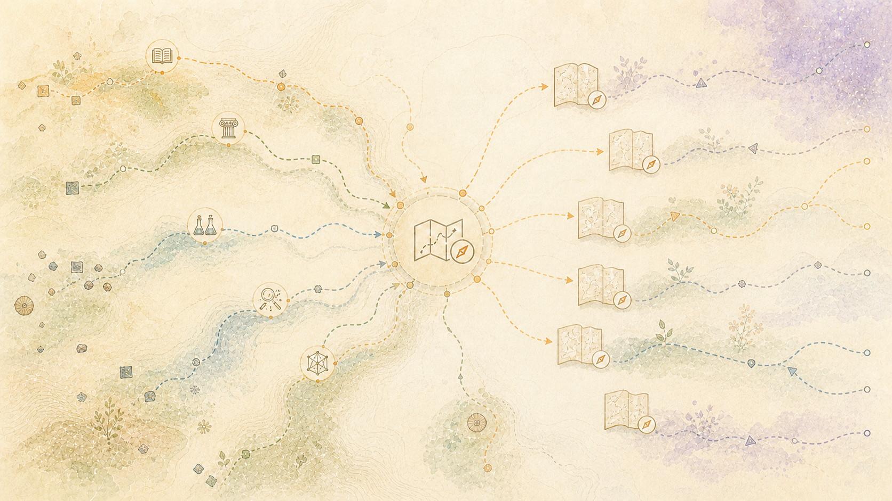

> Gaeilge: Aistriúchán meaisín-chuidithe ar an bhfoinse údarásach Béarla. Tá fáilte roimh cheartúcháin dhúchais. [Béarla](../../README.md) | [Gach teanga](../README.md)

# Creidmheas a Thabhairt agus Luach Fáltais

Cuireadh an córas le chéile go neamhspleách ó chrua-earraí athláimhe den chuid is mó, acmhainní pearsanta, agus iarracht shubstaintiúil lasmuigh den fhostaíocht. Tháinig a bhunús intleachtúil ó dhaoine agus ó institiúidí a bhí sásta saothar a fhoilsiú a d’fhéadfadh daoine eile a iniúchadh, a thástáil, a oiriúnú laistigh dá théarmaí, a cháineadh agus tógáil air. Dá bhrí sin, taifeadann an sannadh lineage teicniúil agus oibleagáid chómhalartach araon: rinne obair phoiblí an obair indéanta, agus cuireann an t-eagrán poiblí a thorthaí teorann ar ais gan úinéireacht a éileamh ar na comhthéacsanna a chruthaigh iad.

## Cén fáth a bhfuil an mórleabhar seo ann

Ní fhéadfadh an saothar a bheith ann gan daoine a roghnaigh taighde a fhoilsiú, bogearraí a scríobh agus a chothabháil, saothair chultúrtha a chaomhnú, téacsanna a aistriú, corpora a choimeád, cartlanna a oibriú, agus a saothar a chur ar fáil le haghaidh athúsáide nó staidéir. Is cleachtadh ceannasacht é a gcinneadh comhroinnt. Ní dhéanann infhaighteacht phoiblí a ranníocaíocht anaithnid nó gan úinéir.

Taifeadann an mórleabhar na príomhranníocaíochtaí a úsáidtear san ailtireacht phoiblí. Sonraíonn sé cad a sholáthair gach foinse, conas a úsáideadh é, agus an gaol idir an fhoinse agus an tionscadal seo. Tá na catagóirí tábhachtach:

- ciallaíonn **spleáchas gníomhach** na bogearraí nó an tsamhail a fheidhmítear i gconair reatha;
- ciallaíonn **modh oiriúnaithe** cur chun feidhme a úsáideann meicníocht fhoilsithe gan
  an cód bunaidh a éileamh mar údar tionscadail;
- Ciallaíonn **foinse calabrúcháin** gur tomhaiseadh ábhar, nár atáirgeadh go poiblí
  scaoileadh ;
- ciallaíonn **tionchar dearaidh** gur athraigh an obair cinneadh ailtireachta;
- Coinníonn **luacháilte nó diúltaíodh** creidmheas agus toradh turgnaimh gan
  glacadh le tuiscint.

Ní thugann aon iontráil le tuiscint go dtacaíonn a húdair, a chothaitheoirí, a pobail, a bhfoilsitheoirí, a chartlanna nó a institiúidí leis an tionscadal seo. Ní athdháileann an doiciméadú ZIP seo aon cheann dá gcód, dá mheáchain múnla, dá théacs tacair sonraí, ná dá n-alt téacs.

## Fondúireachtaí liteartha, teanga agus cumarsáide

| Ranníocaíocht | Foinse poiblí nó obair aitheantais | Cad a chuireann sé anseo | Gaol |
|---|---|---|---|
| Carlota S. Smith | *Modhanna dioscúrsa: Struchtúr Áitiúil Téacsanna* | Idirdhealuithe gramadaí i measc modhanna dioscúrsa; tacaíonn anailís seachadta clóscríofa. | Tionchar deartha |
| M. A. K. Halliday agus Ruqaiya Hasan | *Cohesion as Béarla* | Scarann ​​sé comhtháthú dromchla ó chomhleanúnachas iarbhír. | Tionchar deartha agus bunús tomhais |
| M. A. K. Halla | Cláraigh mar réimse, tenor, agus mód | Déileáiltear leis an lucht éisteachta agus an staid chumarsáideach mar thoisí tomhaiste seachas maisiú pras. | Tionchar deartha |
| Douglas Biber | *Athrú trasna cainte agus scríbhneoireachta* | Anailís iltoiseach cláir ag baint úsáide as gnéithe inbhraite comh-tharlaitheach. | Weave lineage tomhais |
| William Mann agus Sandra Thompson | Teoiric Struchtúr Reitriciúil | Caidreamh dioscúrsa, núicléach, agus an t-idirdhealú idir ábhar lárnach agus ábhar tacaíochta. | Líníocht speisialtóireachta gníomhach |
| Seán Snámh | *Anailís Seánra* | Gluaiseann reitriciúil agus céimeanna a úsáidtear chun cur síos a dhéanamh ar struchtúr an táirge. | Líníocht conradh táirge |
| Gérard Genette agus traidisiún Foirmiúil na Rúise | *Dioscúrsa Inse*; fabula agus sjuzhet | Scarann ​​sé ábhar an imeachta ó ord agus ó dhearcadh a insinte. | Tionchar insinte agus atógála |
| H. P. Grice | “Loighic agus Comhrá” | Uasmhéideanna comhoibritheacha agus an difríocht idir flouting d'aon ghnó agus sárú de thaisme. | Prótacal Daonna agus dearadh braite |
| Dubhghlas Walton | Scéimeanna argóinte agus ceisteanna criticiúla | Soláthraíonn sé patrúin dúshláin inspectable seachas scór argóinte teimhneach amháin. | Argóint-anailís tionchar |
| Alexandra Aikenvald | *Fianaise* | Déileálann sé le marcáil foinse agus fianaise mar fhreagracht teanga. | Tionchar eipistéimeach-ról |
| Claude Shannon | “Teoiric Mhatamaiticiúil na Cumarsáide” | Soláthraíonn sé an stór focal cumarsáide foirmiúil le haghaidh faisnéise, teorainneacha cainéal, iomarcaíocht, agus caillteanas. | Tionchar na hailtireachta cumarsáide |
| Herbert Clark agus Susan Haviland | Conradh nua tugtha | Tacaíonn sé le tomhas a bhfuil ar eolas ag glacadóir agus cad is gá a thabhairt isteach. | Weave lineage tomhais |
| Morton Ann Gernsbacher | Creat tógála struchtúir | Tacaíochtaí bunaithe ar ghlacadóir-dhírithe, léarscáiliú, agus anailís comhleanúnachais. | Tionchar Prótacail Daonna |
| Benjamin Bloom; Lorin Anderson agus David Krathwohl | Tacsanomaíochtaí cuspóirí oideachais | Soláthraíonn sé stór focal teoranta do dhoimhneacht an ghlacadóra a bhfuiltear ag súil leis. | Tionchar conartha lucht éisteachta |

Sholáthair na saothair seo modhanna agus ceisteanna, ní freagraí uilíocha faoi dhuine. Is é an ranníocaíocht ailtireachta ná a gcuid meicníochtaí teorann a nascadh le líne tionóil a chaomhnaíonn bunáitíocht agus gach tátal a choinneáil inchúlaithe agus infheicthe.

## Roghnú, eagarthóireacht, agus réadú

| Ranníocaíocht | Foinse poiblí | Cad a chuireann sé anseo | Gaol |
|---|---|---|---|
| Jaime Carbonell agus Jade Goldstein | “Úsáid MMR, Athrangú Bunaithe ar Éagsúlacht chun Doiciméid a Athordú agus Achoimrí a Tháirgeadh” | Cothromaíonn sé ábharthacht agus úrnuacht le linn roghnú teorann. | Modh oiriúnaithe |
| Hui Lin agus Jeff Bilmes | Achoimre fomhodúil faoin mbuiséad | Laghdú-roghnú fillte faoi bhuiséad sainráite. | Modh oiriúnaithe |
| Eric Malmi, Sebastian Krause, Sascha Rothe, Daniil Mirylenka, agus Aliaksei Severyn | LaserTagger | Léiríonn eagarthóireacht shrianta le foclóir ionsáite dúnta. | Tionchar deartha measúnaithe |
| Kostiantyn Omelianchuk, Vitaliy Atrasevych, Artem Chernodub, agus Oleksandr Skurzhanskyi | GECToR | Léiríonn claochluithe clibeáilte agus ceartúchán atriallach. | Tionchar deartha measúnaithe |
| Jonathan Mallinson, Jakub Adamek, Eric Malmi, agus Aliaksei Severyn | EditT5 | Léiríonn sé athordú pointeoir-bhunaithe a chuireann srian ar aireagán. | Tionchar deartha measúnaithe |
| Eric Malmi agus comhoibrithe; an pobal réadaithe dromchla níos leithne | Obair ghramadach-bhunaithe, ghraf-go-téacs, agus réadú srianta | Treisíonn sé deighilt maidir le hábhar a chinneadh, a phleanáil, a réadú agus a fhíorú. | Tionchar ailtireachta; gan aon uchtú uile-ama rite |

## Speisialtóirí réasúnaíochta, dioscúrsa agus fíoraithe

| Ranníocaíocht | Foinse poiblí | Cad a chuireann sé anseo | Gaol |
|---|---|---|---|
| Elena Chistova agus ranníocóirí IsaNLP | [Múnla cárta IsaNLP RST Parser v3](https://huggingface.co/tchewik/isanlp_rst_v3)agus an obair ACL a luadh; taifid chárta samhail CC BY-NC 4.0 | Táirgeann struchtúir dioscúrsa teorantach agus caidreamh iarrthóirí. Ní chinneann sé brí phearsanta. | Speisialtóir gníomhach; úsáidtear an tsamhail laistigh dá theorainn cheadúnais neamhthráchtála agus níl sé athdháilte anseo |
| Shon Otmazgin, Arie Cattan, Yoav Goldberg, agus rannpháirtithe FastCoref | [Páipéar F-COREF agus cur i bhfeidhm oifigiúil](https://github.com/shon-otmazgin/fastcoref), MIT | Táirgeann slabhraí croí-chomhdhála iarrthóra le haghaidh bailíochtú níos déanaí faoi cheangal foinse. | Speisialtóir gníomhach |
| Chris Reed, an grúpa ARG-tech, ranníocóirí AIF/xAIF, agus ranníocóirí AMF/ARI | [Clár modúl oAMF](https://github.com/arg-tech/oAMF),[Tacar sonraí AIF agus clárlann samhail](https://github.com/arg-tech/aif-arg-datasets), agus sonraíochtaí nasctha | Aicmíonn caidreamh tairgthe teorantach agus soláthraíonn sé stór focal idir-inoibritheach ar ghraf argóinte. | Is sainlíne ghníomhach é AMF/ARI; Rinneadh luacháil ar oAMF mar ealaín roimhe seo le haghaidh ceolfhoirne seachas mar ealaín mórdhíola glactha |
| Liyan Tang, Philippe Laban, agus Greg Durrett | [MiniCheck](https://aclanthology.org/2024.emnlp-main.499/);[cód oifigiúil](https://github.com/Liyan06/MiniCheck) | Breathnuithe éifeachtúla fírinneachta ar éilimh agus ar dhoiciméid forais. | Speisialtóir measta; gan údarás a scaoileadh |
| Deren Lei, Yaxi Li, Siyao Li, Mengya Hu, Rui Xu, Ken Archer, Mingyu Wang, Emily Ching, agus Alex Deng | [FactCG](https://aclanthology.org/2025.naacl-long.258/);[cód oifigiúil](https://github.com/derenlei/FactCG) | Breathnuithe fíoras il-hop ar an eolas faoi ghraif. | Speisialtóir measta; gan údarás a scaoileadh |
| Philippe Laban, Tobias Schnabel, Paul N. Bennett, agus Marti A. Hearst | [SummaC](https://aclanthology.org/2022.tacl-1.10/) | Nochtann sé fadhbanna gráinneachta abairtí/doiciméad agus seiceáil comhsheasmhachta. | Tionchar deartha |
| Lorena Scirè, Simone Conia, agus Roberto Navigli | [FÉINÉIS](https://arxiv.org/abs/2403.02270) | Eastóscadh éileamh agus ailíniú fianaise le haghaidh meastóireachta achoimre. | Tionchar deartha |
| Xiangkun Hu agus comhoibrithe | [RefChecker](https://github.com/amazon-science/RefChecker) | Tacaíocht mhínghlanta, bréagnú, agus taifid anaithnide. | Tionchar deartha measúnaithe |
| Trieu H. Trinh agus comhoibrithe | [Alfa Céimseata](https://github.com/google-deepmind/alphageometry) | Dúnadh asbhainte monotonach agus rianta soiléire cruthúnais-spleáchais. Ní úsáidtear rialacha céimseata. | Tionchar deartha |

Rinneadh measúnú ar MiniCheck agus FactCG le hathbhreithnithe poiblí pinn agus a gceadúnais foilsithe. Ní raibh a gcuid scóir inscartha ar shóruithe tábhachtacha tionscadal-chruthach, agus mar sin baineadh den údarás scaoilte iad. Is cuid den chómhalartacht an toradh diúltach sin a chaomhnú: tugtar creidiúint do na huirlisí as an méid is féidir leo a thabhairt faoi deara gan mífhaisnéis a dhéanamh ar an méid a mhaígh a n-údair go bhféadfadh siad a chruthú.

## Rannpháirtithe bogearraí

Soláthraíonn na tionscadail bogearraí poiblí seo a leanas innealra teorantach. Rialaíonn a bhfógraí cóipchirt agus a gceadúnais faoi seach aon athdháileadh ar a gcód; ní athdháileann an doiciméadacht phoiblí seo é.

| Bogearraí | Ranníocóirí nó maor | Ceadúnas taifeadta | Ról teorantach |
|---|---|---|---|
| spaCy agus a samhlacha teanga | Pléascadh AI, Matthew Honnibal, Ines Montani, agus rannpháirtithe | MIT | Cuid de chaint, deilbhíocht, parsáil spleáchais, agus tomhais Struchtúracha |
| BlingFire | Microsoft agus rannpháirtithe | MIT | Deighilt abairtí |
| LemmInflect | Brad Jascob agus na rannpháirtithe | MIT | infhilleadh Béarla |
| fomhodlib | Vishal Kaushal, Rishabh Iyer, Ganesh Ramakrishnan, agus rannpháirtithe DECILE | MIT | Roghnú fomhodúil |
| NLTK | Steven Bird, Edward Loper, Ewan Klein, agus na rannpháirtithe | Apache-2.0 | Rochtain corpais agus fóntais teanga |
| UimhPy | NumPy ranníocóirí | BSD-3-Clásal | Eagair uimhriúla agus maitrísí cosúlachta |
| SciPy | Ranníocóirí SciPy | BSD-3-Clásal | Oibríochtaí cnuasaithe agus staidrimh |
| LíonraX | Ranníocóirí NetworkX | BSD-3-Clásal | Oibríochtaí agus tomhais graif faoi stiúir |
| glúine | Kevin Arvai agus na rannpháirtithe | BSD-3-Clásal | Brath pointe glúine do chuair chalabrúcháin tomhaiste |
| PyYAML | Kirill Simonov agus na rannpháirtithe | MIT | Idirmhalartú cumraíochta struchtúrtha |
| httpx | Tom Christie agus na rannpháirtithe | BSD-3-Clásal | Seirbhís-teorainn HTTP iompar |
| sícóip | Daniele Varrazzo agus na rannpháirtithe | LGPL-3.0 | Rochtain PostgreSQL |
| Pidantach | Ranníocóirí Pydantic | MIT | Bailíochtú clóscríofa agus sraitheachú |
| OscailVINO | Intel agus rannpháirtithe | Apache-2.0 | Tátail shamhail theoranta nuair atá sé cumraithe |
| téacsthuairiscí | Lasse Hansen, Kenneth Enevoldsen, agus rannpháirtithe | Apache-2.0 | Inléiteacht, comhleanúnachas, agus faisnéis-teoiric tomhais.... |
| LFTK | Bruce W. Lee agus Jason Hyung-Jong Lee | Ceadúnas tionscadail phoiblí; fíorú le haon scaoileadh athdháilte | Eastóscadh gné theangeolaíoch measúnaithe le haghaidh calabrú |

Príomhfhardal atá sa tábla, ní ionadach é d’fhógraí spleáchais arna nginiúint ag meaisín i ndáileadh cód sa todhchaí. Ní mór leaganacha cruinne, hashes, ceadúnais aistritheacha, agus téacsanna ceadúnais iomlána a bheith in éineacht le haon eisiúint a athdháileann bogearraí nó comhaid mhúnla.

## Saothair chultúrtha, corpora, cartlanna, agus pobail....

Tomhaiseann an anailís patrúin seachadta agus airíonna struchtúracha. Mura gceadaíonn ceadúnas ar leith atáirgeadh, tá tomhais chomhiomlána agus féiniúlachtaí foinse, ní téacs foinseach san aschur poiblí.

| Foinse | Daoine nó institiúid atá á gcreidiúnú | Teorainn ceada agus úsáide | Ranníocaíocht |
|---|---|---|---|
| Tionscadal Gutenberg | Michael S. Hart, Proofreaders Dáilte, údair rannpháirteacha, eagarthóirí, aistritheoirí, agus oibrithe deonacha | Déantar téacsanna fíoraithe fearainn phoiblí a thomhas; Tá meas i gcónaí ar théarmaí agus ar thrádmharc eagrán Project Gutenberg. | Calabrú fada liteartha agus foirm táirge |
| LibriVox | Léitheoirí deonacha, cothaitheoirí, agus údair téacsanna foinse poiblí-fearainn | Déanann LibriVox taifead ar théacsanna fearainn phoiblí agus tiomnaíonn a thaifeadtaí don fhearann ​​poiblí faoina bheartas sonraithe. | Calabrú labhartha-seachadadh an iarrthóra; gan a chomhthiomsú go ciúin le cló |
| Corpas Donn | W. Nelson Francis, Henry Kučera, Ollscoil Brown, agus coimeádaithe | Úsáidtear é trína théarmaí corpais dáilte chun comhiomlán a thomhas. | Codarsnacht le clár lipéadaithe seánra |
| Reuters-21578 | Reuters, David Lewis, agus coimeádaithe | Tomhais chomhiomlána faoi théarmaí dáileacháin an tacair sonraí amháin. | Comparáid dhlúth chóip sreang |
| Corpas Comhrá NPS | Eric Forsyth, Jane Lin, Craig Martell, agus Scoil Iarchéime an Chabhlaigh | Tomhas comhiomlán; ní dhéantar téacs pearsanta a atáirgeadh go poiblí. | Comparáid comhrá idir duine agus duine |
| Aistriúcháin Dearbhú Uilechoiteann Chearta an Duine | OHCHR na Náisiún Aontaithe agus aistritheoirí | Aistriúcháin comhthreomhara tomhaiste mar rialtán; sannadh coinnithe. | Scarann ​​sé patrúin prótacail tras-teanga ó nósanna Béarla |
| arXiv | Ollscoil Cornell, arXiv, údair a chur isteach, agus cothaitheoirí.... | Déileáiltear le meiteashonraí de réir a dtéarmaí foilsithe; Fanann coimrithe de shaothar na n-údar agus ní dhéantar iad a atáirgeadh. | Tomhas fadaimseartha eolaíoch-clár |
| PubMed/MEDLINE | Leabharlann Náisiúnta Leigheas na SA, irisí rannpháirteacha, agus údair | Tomhas comhiomlán amháin; ní dhéantar achoimrí a athdháileadh agus níl aon fhormhuiniú NLM intuigthe. | Comparáid eolaíoch prós |
| Delpher | Koninklijke Bibliotheek, ranníocóirí digitithe, foilsitheoirí, agus údair | Tomhas comhiomlán amháin toisc go n-athraíonn cearta leibhéal na míre. | Comparáid nuachtán fadtréimhseach |
| Vicipéid | Fondúireacht Wikimedia agus eagarthóirí rannchuideacha | foinse CC BY-SA; níl aon alt téacs san fhoilseachán seo. | Comparáid chlár encyclopedia |
| Stack Overflow | Stack Exchange agus an pobal freagartha | foinse CC BY-SA; níl aon phost-téacs á atáirgeadh anseo. | Comparáid idir an fóram agus an freagra |
| Samplaí Hacker News agus Mastodon | Oibreoirí ardáin agus údair pobail aonair | Ní ghlactar le ceadúnas aon inneachair ghinearálta; ní féidir ach breathnuithe comhiomlána neamh-shainaitheanta a fhoilsiú. | Comparáid taiscéalaíoch i bhformáid nua-aimseartha |

Ní seilbh ar na hoibreacha seo é tuairisceán cómhalartach an tionscadail phoiblí. Is cuntas in-iniúchta é ar na modhanna a chumasaigh siad, na teorainneacha a aimsíodh, na hipitéisí ar theip orthu a chabhraigh leo a fhalsú, agus tomhais ath-inúsáidte a chaomhnaíonn cosán ar ais chuig a gcuid rannpháirtithe.

Rialaíonn cómhalartacht úsáid mhúnla sheachtrach freisin. Ní fhágann soláthar pálasta oibre údaraithe do ranníocaíocht theoranta an tseirbhís sheachtrach ina úinéir ar an gcorpas faoi chothabháil, díreach mar nach scriosann taighde foilsithe a údar. Ba cheart an ranníocaíocht a chur chun sochair agus a thomhas, fad is atá foinse, údarás agus luach leanúnach an bhuntaifid ar leith fós. Cuireann cómhalartacht cosc ​​ar dhíorthú úsáideach a bheith ina leithscéal chun comhthéacs an duine a mhilleadh agus a luach a dhíriú laistigh den institiúid glactha.

## Teorainn cearta agus iomláine

Is stáit chearta éagsúla iad stádas fearainn phoiblí, rochtain oscailte, foinse oscailte, agus cead anailíse ríomhaireachtúil. Taifeadann an mórleabhar an bonn infheidhmithe seachas caitheamh le “ar fáil ar líne” mar chead. Eisiatar ó thacair sonraí nua foilseacháin foinsí óna dteastaíonn imchéimniú, údarú éiginnte, nó teoiric neamhathbhreithnithe um úsáid chóir.

Clúdaíonn an mórleabhar na bunsraitheanna atá le feiceáil sna doiciméid phoiblí. Coinníonn an tionscadal príobháideach fardal níos mó atá ag athrú, lena n-áirítear iarrthóirí a ndearnadh meastóireacht orthu agus iarrthóirí diúltaithe. Ní mór d’eisiúint scolártha nó bhogearraí amach anseo bille bogearraí a bhaineann go sonrach le déantúsáin a sholáthar, ina mbeidh ábhar, mórleabhar samhlacha agus tacair sonraí, leabharliosta, beart ceadúnais, agus taifead claochlaithe. Ní scriosann easnamh ón achoimre seo creidmheas ná ní thugann sé cead.
