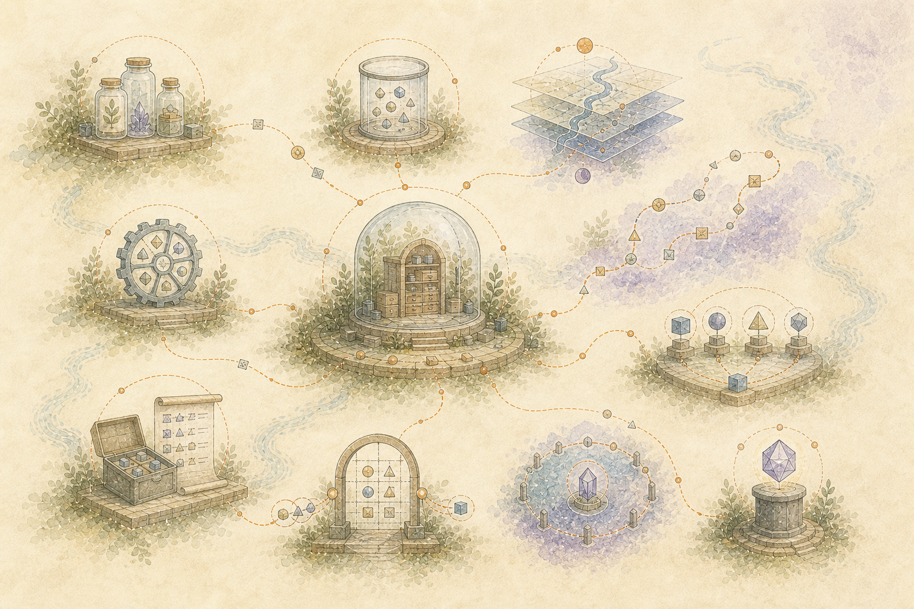

> Italiano: Traduzione assistita da macchina dell'autorevole fonte inglese. Sono gradite correzioni nella lingua madre. [Inglese](../../README.md) | [Tutte le lingue](../README.md)

# Una lingua condivisa

**Artefatto**: qualsiasi input conservato o prodotto generato.

**Deposito**: un artefatto che entra nel corpus autorevole. La sua esistenza ha valore anche quando non se ne conosce ancora la ragione o la relazione.

**Ritiro**: Un recupero limitato o un prodotto generato ottenuto da depositi selezionati e osservazioni derivate. Non sostituisce mai le sue fonti.

**Rappresentazione**: una vista derivata come testo estratto, descrizione multimediale, incorporamento, unità semantica o classificazione.

**Evento di osservazione**: prova che si è verificata una prospettiva, una reazione, una domanda o un rapporto. È distinto dalla verità di qualsiasi proposizione al suo interno.

**Ruolo epistemico**: lo status del contenuto come osservazione, affermazione, interpretazione, ipotesi, metafora, sentimento, domanda, piano, fallimento, correzione, citazione o sconosciuto.

**Mappa temporale**: il livello di relazione con versione sopra il corpus, inclusa la cronologia di osservazione, validità e sostituzione.

**Matrice di significato personale**: una proiezione multidimensionale, nell'ambito della richiesta, dei contributi e delle incertezze di significatività legati alla fonte. Non è un modello di personalità.

**Camminata all'indietro**: attraversamento da un obiettivo ricco di contesto verso prove correlate precedenti senza assegnare la struttura del prodotto finale.

**Ricostruzione in avanti**: inversione sullo stesso grafico selezionato per spiegare il viaggio in un ordine decodificabile dall'uomo.

**Collapse**: partizionamento specifico del prodotto, esplicitamente con perdita di rami grafici selezionati rispetto a lavori semantici e retorici.

**Cog o specialista**: una componente delimitata con input, output, limiti, costi e autorità dichiarati.

**Linea di montaggio**: la disposizione specifica del prodotto di specialisti utilizzata per creare un ritiro.

**Handoff**: carico utile digitato e trasferimento di responsabilità tra specialisti.

**Modello di lavoro compatto**: prove portatili, ragionamento, requisiti del prodotto e maniglie di espansione assemblati per un output. Non è un modello generale addestrato.

**Registro del carico utile**: la registrazione di audit di ciò che ciascuna fase ha ricevuto, prodotto, omesso, costato e contribuito.

**Protocollo umano**: il confine bidirezionale per adattare la struttura gestita dalla macchina a un particolare stato di comunicazione umana senza rivendicare l'accesso all'implementazione interna della persona.

**Trama**: la traiettoria misurata e l'equilibrio delle funzioni di consegna in un prodotto.

**Tenuta**: Un parametro di scala o densità applicato a un'armatura senza ridefinirne i compiti di consegna.

**Base**: il requisito che un contributo generato rimanga riconducibile a prove autorizzate o sia chiaramente classificato come interpretazione, incertezza o assenza.

**Receipt gate**: verifica indipendente che richiedeva invarianti mantenute per byte artefatto esatti. L'uscita dal processo da sola non è accettazione.

**Sostituzione**: un'osservazione successiva che sostituisce un'interpretazione precedente per un uso successivo senza eliminare lo stato storico precedente.

**Sovranità personale**: il confine di proprietà e autorità attorno all'esperienza, all'identità, all'attenzione, all'espressione e alla capacità di determinare il significato di una persona.

**Contributo esterno limitato**: un trasferimento autorizzato, specifico per la richiesta, in cui uno specialista esterno riceve solo il carico utile necessario per un'operazione dichiarata. Il carico utile può essere utile pur rimanendo insufficiente per ricostruire il corpus conservato, la provenienza, la storia temporale, il significato personale o il meccanismo che produce prelievi futuri. Questo confine impedisce che un contributo ristretto diventi estrazione e riduzione distruttiva della conoscenza umana a valore istituzionale.
