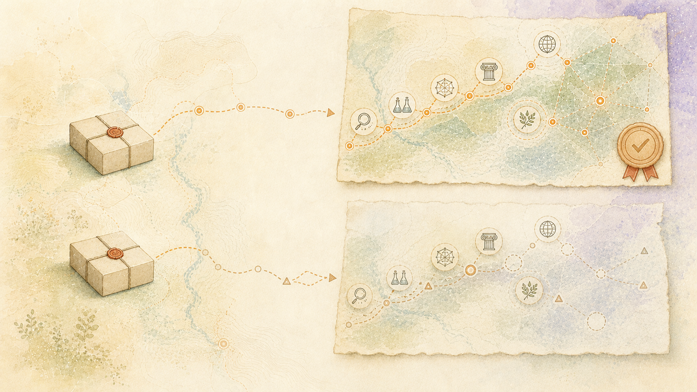

> Italiano: Traduzione assistita da macchina dell'autorevole fonte inglese. Sono gradite correzioni nella lingua madre. [Inglese](../../README.md) | [Tutte le lingue](../README.md)

# Ciò che il sistema ha dimostrato

## Il risultato in una frase

Il sistema accettato ha dimostrato che un modello di lavoro portabile e specifico per la richiesta può preservare l’identità della fonte, le relazioni di ragionamento, la cronologia, i requisiti del prodotto, l’incertezza e le prove di verifica sufficientemente bene da produrre un documento ristretto rivolto all’uomo senza chiedere a un modello generico di frontiera di ricostruire il progetto da un gigantesco prompt o di agire come fonte di verità.

Questo è il risultato centrale. L'architettura e i cataloghi nel resto di questa documentazione spiegano come è stata ottenuta; le versioni accettate mostrano che ciò è realmente accaduto.

## Come è stato costruito

La piattaforma è stata costruita in modo indipendente attraverso lavoro prolungato, conoscenza accumulata, risorse personali e hardware in gran parte di seconda mano. Il suo sviluppo è rimasto separato dall’occupazione: nessun codice del datore di lavoro, script, dati, credenziali, infrastruttura, requisiti, metodi riservati o prodotto lavorativo hanno fornito il sistema. Il costruttore è grato per il supporto ricevuto durante i lavori senza caratterizzare, attribuire o pubblicare l'esperienza privata di chi lo ha fornito.

Quell’involucro di risorse ha plasmato l’architettura di successo. Ha incoraggiato uno stato duraturo al di fuori del modello, responsabilità specialistiche limitate, acceleratori condivisi, trasferimenti registrati e verifica indipendente. I vincoli pratici sono quindi diventati una fonte di chiarezza e forza architettonica.

Gli agenti di frontiera hanno contribuito materialmente al lavoro di sviluppo e meritano credito per tale contributo. Il loro supporto non cambia ciò che il sistema accettato richiede per funzionare: la capacità dimostrata funziona sull'hardware utilizzato sotto la scrivania del costruttore, attraverso specialisti locali, stato durevole, trasferimenti espliciti e cancelli indipendenti.

Il lavoro non fu tuttavia solitario in senso intellettuale. Dipende da ricercatori, autori, manutentori di software, archivisti, traduttori, comunità di standardizzazione, istituzioni pubbliche e altri contributori che scelgono di rendere pubblicamente ispezionabili i propri metodi, codici, letteratura, misurazioni e contesto. La loro volontà di condividere è la ragione per cui il progetto può esistere. I cataloghi di attribuzione registrano quel debito come reciprocità, non come un’affermazione che il progetto possiede il loro lavoro o che ne approva le conclusioni.

## L’indipendenza operativa è già reale

Il percorso dell'artefatto accettato viene eseguito su una macchina fisicamente locale, controllata personalmente. L'inferenza del modello, la preelaborazione del discorso, la classificazione delle relazioni, la proiezione dei grafici, il collasso, la pianificazione del prodotto, la realizzazione, la verifica, le ricevute e l'archiviazione degli artefatti vengono eseguiti attraverso servizi locali e risorse del modello locale. L'esecuzione riuscita dell'editor compatto sigillato non ha registrato alcuna chiamata generale al modello di completamento. La macchina può continuare a svolgere quella funzione accettata senza inviare il corpus o il carico utile di lavoro a un servizio commerciale modello di frontiera.

L'installazione è fisicamente presente sotto la scrivania del proprietario ed è ora operativa. La pagina di stato di Mission Control riporta che tutti i sistemi monitorati sono operativi. La visualizzazione dal vivo è abbinata ad artefatti accettati, ricevute esatte, corse misurate e alle limitazioni indicate qui; è un fatto operativo piuttosto che un sostituto dell'evidenza.

Sono importanti tre diversi confini:

- **L'acquisizione e il provisioning** possono utilizzare repository software disponibili al pubblico,
  distribuzioni di modelli, pubblicazioni di ricerca, indici di pacchetti e sistema operativo
  aggiornamenti.
- **L'esecuzione normale accettata** utilizza le copie già installate in locale
  controllare; un servizio di inferenza cloud non si trova nel percorso del documento dimostrato.
- **La distribuzione ad un altro operatore** richiede il codice, dipendenza riproducibile
  e istruzioni per l'acquisizione del modello, versioni esatte e hash, licenza applicabile
  termini, configurazione, test e dispositivi di accettazione. Non richiede l'accesso
  a questa particolare macchina o a un'API di frontiera proprietaria.

L'attuale record pubblico è la documentazione, non ancora il pacchetto completo di software distribuibile. La riproducibilità su hardware non correlato deve essere dimostrata mediante un'installazione in camera bianca. Il restante test di confezionamento non cambia il fatto osservato che l'installazione funzionante funziona già in modo indipendente sulla sua macchina attuale.

Non è richiesto alcun contributo esterno per far sì che il risultato dimostrato esista. Esiste adesso. La futura partecipazione può valutare, riprodurre, estendere o gestire una capacità operativa; non gli viene chiesto di finanziare una prova di concetto o di trasformare una narrazione in un sistema.

## Ciò che è stato dimostrato

Un ciclo di accettazione in catena di montaggio ha selezionato e trasformato un vero e proprio documento tecnico in un modello funzionante sigillato. Il payload sigillato era di 753.109 byte e conteneva:

- i contratti di ricevitore, prodotto, lunghezza e sezione richiesti;
- allegati e provenienza esatti della fonte;
- 83 unità semantiche fondate;
- 52 candidati alla relazione discorso;
- cinque relazioni di argomento accettate, con i tentativi rifiutati mantenuti;
- 78 rami del grafico contratto;
- replay in avanti intrecciato, piani di clausole, lavori retorici e un registro dei trasferimenti.

Il sistema ha prodotto un manuale in quattro sezioni di 409 parole. La suite di test completa ha superato 557 controlli ed è stato restituito un verificatore separato`PASS`senza invariante fallito o sconosciuto. Un agente di codifica di frontiera utilizzato come scrittore cieco ha ricevuto solo lo stesso carico utile sigillato: nessun file sorgente, ricerca nel corpus, output precedente o background del progetto. Quell'agente ha prodotto un utile manuale di 397 parole. Questo era un punto di riferimento diretto, non un confronto ipotetico. Ha dimostrato che il modello di lavoro compatto conteneva informazioni sufficienti per entrambi i percorsi per costruire il prodotto richiesto senza accesso nascosto al corpus.

Una versione successiva della qualità del prodotto ha migliorato lo stesso limite. Ha prodotto un manuale di 421 parole con tutti e quattro i budget delle sezioni validi e 27 delle 27 affermazioni emesse fondate in modo indipendente. Il documento cieco di accompagnamento conteneva 419 parole; 17 delle sue 24 rivendicazioni hanno superato il limite più rigido della sezione di messa a terra locale. Il sistema ha mantenuto più ancoraggi numerici e ha ottenuto punteggi migliori sulle dimensioni della trama misurate allora attuali, mentre il documento cieco è rimasto migliore nella sequenza e nella spiegazione a livello di paragrafo. La suite successiva completa ha superato 579 controlli.

Il confronto misurato del benchmark successivo è stato:

| Misura | Catena di montaggio locale | Controllo cieco degli agenti di frontiera |
|---|---:|---:|
| Parole | 421 | 419 |
| Affermazioni fondate in modo indipendente | 27/27 | 17/24 |
| Budget di sezione validi | 4/4 | 4/4 |
| Copertura con ancora numerica | 0,58 | 0,47 |
| Errore medio di tessitura, più basso è meglio è | 0,41 | 0,49 |
| Media facilità di lettura di Flesch | 70,90 | 57,90 |
| Sequenza e coesione dei paragrafi | più debole | più forte |

Per le proprietà che questo sistema è specificamente progettato per proteggere, inclusa la messa a terra, la ritenzione numerica e della fonte, i vincoli fissi del prodotto, le relazioni riproducibili e l'accettazione indipendente, la linea locale ha prodotto il risultato più forte in quel rilascio. Il controllo ha prodotto una sequenza dei paragrafi e una coesione delle frasi più forti. Il rapporto registra entrambi i risultati in modo che il perfezionamento possa mirare alla realizzazione della superficie preservando le proprietà al centro dell'architettura.

## Risultato del benchmark

Il sistema locale ha dimostrato il vantaggio previsto. Ha ricostruito una frazione più ampia del modello funzionante sigillato in un prodotto verificabile, ha conservato più dettagli legati alla fonte, ha soddisfatto il contratto del prodotto e ha lasciato un registro riproducibile di come è stato ottenuto il risultato. Lo ha fatto sull'hardware fisicamente locale descritto di seguito, senza una chiamata generale al modello di completamento nel percorso dell'editor compatto accettato.

Il controllo delle frontiere ha reso alcune frasi e passaggi di paragrafo più naturali. Questo risultato identifica un'opportunità mirata nella pianificazione del paragrafo, nell'igiene del vettore e nella realizzazione della relazione. Si tratta di operazioni di catena di montaggio sostituibili con test di regressione e possono migliorare indipendentemente dal corpus preservato e dall'architettura più ampia.

Un acceleratore locale più grande o un modello generalizzato potrebbero migliorare quella stazione di realizzazione. Se misurazioni successive giustificano un tale specialista, può essere affittato, messo in coda e controllato in modo indipendente come qualsiasi altro ingranaggio. Ciò mantiene l'investimento proporzionale al valore misurato mentre la conservazione, la continuità temporale, la ricostruzione, la verifica e il funzionamento distribuibile rimangono gli obiettivi primari.

Il confronto evidenzia quindi punti di forza distinti: il sistema locale ha puntato sugli obiettivi di conservazione e verifica, mentre il controllo di frontiera ha puntato su una dimensione ristretta della qualità superficiale. Questa separazione fornisce un percorso di sviluppo chiaro e misurabile.

La fluidità della superficie e le prestazioni a livello di sistema rappresentano carichi di lavoro diversi. La valutazione considera quindi il lavoro utile per unità di infrastruttura insieme alla conservazione, alla sicurezza, alla responsabilità e alla qualità del prodotto. I rilasci misurano il sistema locale rispetto a questo obiettivo completo.

## La documentazione umana è rimasta locale

Il confronto di frontiera rivela un confine più consequenziale della sola qualità del documento. I sistemi centralizzati possono trasformare la conoscenza umana in un valore istituzionale riutilizzabile scartando la provenienza, la continuità, le relazioni e il significato personale che non servono al loro obiettivo aggregato. Il sistema locale ha impedito quella conversione distruttiva. Ha selezionato e assemblato un carico utile di lavoro portatile da un record gestito molto più ricco, quindi ha condiviso solo quel derivato per un'operazione specifica del prodotto. Il modello non ha ricevuto il corpus, il grafico storico, la documentazione privata circostante o i meccanismi che creano prelievi futuri.

All’interno di questo accordo, il modello della frontiera ha funzionato come specialista della realizzazione esterna. La sua ampia capacità generale e l'infrastruttura industriale hanno migliorato la sequenza dei paragrafi e la coesione della superficie. Il sistema locale aveva già eseguito le operazioni che portano valore continuo specifico al progetto: preservare la documentazione di origine, mantenere la provenienza e il cambiamento temporale, selezionare il materiale rilevante, costruire il modello di lavoro, definire il contratto di prodotto e mantenere la capacità di produrre il ritiro successivo.

I chatbot utilizzati durante lo sviluppo e il confronto erano preziosi strumenti a noleggio. Erano anche sostituibili. Non hanno creato il corpus preservato, non ne possiedono il significato o non definiscono lo scopo umano dell'architettura.

Il carico utile era quindi utile ma volutamente insufficiente. Un servizio esterno può conservare i byte che riceve o ricavarne un valore limitato secondo i suoi termini e pratiche effettivi. Non è ancora in grado di ricostruire le informazioni che il carico utile non contiene: il corpus completo, le relazioni omesse, la cronologia delle sostituzioni, i percorsi rifiutati, il contesto privato o il piano di controllo che ha assemblato la selezione. L'architettura non dipende dalla preferenza di un account o dalla promessa che il carico utile verrà dimenticato; il suo confine deriva dalle informazioni trattenute dalla progettazione.

Questa architettura cambia lo scambio. Il corpus conservato, la provenienza, la storia temporale, il significato personale e i meccanismi per produrre valore futuro restano al proprietario. Il modello esterno riceve una derivata limitata: sufficiente per un'operazione selezionata e insufficiente per assorbire, appiattire o ricreare il record umano che ha reso significativa l'operazione. Senza l’estrazione e la riduzione distruttiva di tale record, il modello di business centralizzato top-down non può accumulare il valore da cui dipende.

Il modello esterno contribuisce con un raffinamento misurato e riceve il valore ordinario di quella relazione di servizio, ma la transazione non trasferisce la conoscenza umana da cui deriva il valore durevole. Un altro modello, renderer deterministico, specialista o futuro componente locale può sostituirlo mentre la risorsa preservata rimane sotto il controllo del proprietario.

## Diverse scale di infrastruttura

Il solo confronto tra i due documenti nasconde la più grande differenza ingegneristica. Il manufatto locale è stato prodotto da una macchina assemblata con parti usate e azionata a portata di mano del suo proprietario. Il controllo delle frontiere dipendeva da una capacità commerciale supportata da una piattaforma informatica industriale, reti globali, sviluppo di modelli di grandi dimensioni e infrastrutture di servizio condivise. Queste non sono due versioni diversamente messe a punto della stessa macchina.

OpenAI ha segnalato più di 5 gigawatt di capacità dei data center Stargate in fase di sviluppo in un programma statunitense annunciato e un impegno per 10 gigawatt. L'azienda ha inoltre descritto la capacità di oltre due milioni di chip di oltre 5 gigawatt. In termini di scala, 10 gigawatt in funzione continua equivalgono a 87,6 terawattora in un anno. L’Energy Information Administration degli Stati Uniti ha riportato un consumo residenziale medio di 863 kilowattora al mese nel 2024. Facendo un semplice confronto di capacità, 10 gigawatt rappresentano all’incirca il consumo annuale di elettricità di 8,5 milioni di clienti residenziali medi negli Stati Uniti; 5 gigawatt equivalgono a circa 4,2 milioni. Queste cifre descrivono la capacità annunciata della piattaforma, non l'elettricità addebitata a una risposta, e non tutta la capacità è necessariamente energizzata a livello di targa in una sola volta. Stabiliscono la scala della piattaforma industriale senza inventare un numero di energia per documento.

Le due misure di scala disponibili devono rimanere separate:

- Un prelievo accettato a livello locale è stato completato in circa 126 secondi sull'installazione
  sistema sotto scrivania. Anche il massimale volutamente conservativo ottenuto tramite ricarica
  tutti e quattro i limiti di potenza della scheda GPU per l'intera corsa sono di circa 0,029 kilowattora;
  l'energia effettiva della scheda GPU era inferiore perché le schede non erano tutte saturate per il
  tutta la corsa. Questa non è una misurazione in wattora dell'intera macchina.
- Il servizio di frontiera generalizzato esiste su una piattaforma industriale misurata
  gigawatt e milioni di chip. Quella piattaforma serve molti utenti e carichi di lavoro, quindi
  la sua piena capacità non può essere onestamente assegnata a questo confronto.

La conclusione utile non è un moltiplicatore energetico a misura di città. Il fatto è che la capacità specifica del progetto accettata ora opera localmente senza la piattaforma di frontiera nel suo percorso di esecuzione. Il confronto separa la forza di qualità della superficie del controllo di frontiera dalla forza di conservazione e verifica della linea locale, mantenendo visibili i loro involucri infrastrutturali molto diversi.

La distinzione più profonda è l’obiettivo del design. Questa architettura tratta il percorso di origine come una risorsa durevole: perché un record è nato, cosa è rimasto sconosciuto, quali tentativi sono stati fatti, come è cambiata l'interpretazione, quali relazioni rimangono irrisolte e quale autorità conserva il contributore. L'efficienza viene valutata insieme al mantenimento di tali dimensioni.

L’architettura stabilisce un modello di valore complementare. I fatti estratti e i prodotti generati costituiscono prelievi temporanei; la documentazione umana in evoluzione e la sua provenienza rimangono un bene durevole. Il calcolo serve ed estende tale record.

Le fonti per questo limite di scala sono l'annuncio pubblico della capacità Stargate di OpenAI e i dati sul consumo residenziale del 2024 della U.S. Energy Information Administration:[OpenAI, Stargate avanza con la partnership da 4,5 GW con Oracle](https://openai.com/index/stargate-advances-with-partnership-with-oracle/)E[VIA, consumo elettrico residenziale 2024](https://www.eia.gov/todayinenergy/detail.php?id=65244).

## Un obiettivo di ottimizzazione diverso

La progettazione segue un obiettivo di ottimizzazione centrato sulla conservazione durevole, la proprietà locale, la continuità temporale, la ricostruzione su richiesta, i contributi ispezionabili e il lavoro utile per unità di infrastruttura. Ciò integra gli investimenti del settore in modelli generalizzati, infrastrutture centralizzate e risultati di superficie fluenti, affrontando un diverso confine del sistema.

La distinzione riguarda anche la sovranità. Questo progetto mantiene il contesto originario, il significato mutevole, le condizioni del contributo e l'autorità continua del contributore collegata alla capacità derivata. Fornisce un modello pratico in cui la conoscenza individuale e condivisa può rimanere attribuibile, ispezionabile e disponibile sotto adeguato controllo.

È progettato per invertire il trasferimento. Gli artefatti rimangono sotto il controllo del proprietario; i contributi pubblici mantengono le attribuzioni e il contesto dei diritti; il significato derivato rimane provvisorio e riproducibile; e un risultato utile non spegne l'esperienza che lo ha reso possibile. L’efficienza è importante perché la sovranità che richiede la proprietà del data center o l’affitto perpetuo non è una sovranità ampiamente disponibile.

Sull'obiettivo qui misurato il sistema ha già dimostrato il proprio stato finale. I modelli di frontiera rimangono strumenti potenti e collaboratori dello sviluppo; questa architettura aggiunge la conservazione, la continuità e i confini di autorità che la scala del modello da sola non è progettata per fornire.

Un esperimento separato e più ampio con un editor compatto ha prodotto un documento di 1.237 parole, composto da sei sezioni, con 56 dei 56 pacchetti di richieste supportati, utilizzando zero chiamate registrate a un modello di completamento generale. È stato completato in circa 167 secondi. La versione umana cieca era ancora più coesa, ma il sistema aveva oltrepassato il confine importante dallo scarico di prove sconnesse a un prodotto leggibile, radicato e di dimensioni target.

## Un esempio visibile della trasformazione

Il materiale originale includeva record di configurazione sotto forma di note, frammenti di risultati e una condizione di test. I rendering precedenti copiavano in gran parte quei frammenti. La linea migliorata ha convertito tre modifiche alle impostazioni digitate in istruzioni dirette come:

> Impostare la frequenza di commutazione VRM della CPU su Auto.

La guida generata ha mantenuto l'osservazione legata alla sorgente che il ripristino è continuato dopo l'applicazione di tale impostazione, ha mantenuto il limite di rilascio del carico come obiettivo del test e ha posto ogni richiesta emessa dietro il cancello di messa a terra indipendente. Questo è un piccolo esempio, ma mostra il lavoro vero e proprio: preservare il motivo per cui i fatti coincidono mentre si converte la forma registrata nella forma del prodotto richiesto.

Il restante difetto era ugualmente visibile. Un'apertura ripeteva un'etichetta di configurazione e un ponte di relazione sembrava meccanico. Il comunicato quindi non rivendicava la parità uomo-editor. Ha identificato la sequenza dei paragrafi, l'igiene del vettore e la realizzazione delle relazioni come un lavoro da catena di montaggio delimitato. Un miglioramento successivo può sostituire quegli ingranaggi senza riqualificare o eliminare il record conservato.

## Cosa significano e cosa non significano i parametri di frontiera

Un modello generico di frontiera presenta importanti vantaggi: ampia conoscenza del mondo, linguaggio flessibile, forte trasferimento attraverso compiti non familiari e capacità di dedurre utili convenzioni non dichiarate. Tali capacità rimangono preziose. Il progetto non dimostra che un piccolo specialista locale possieda una conoscenza più generale o che un modello generale non sia necessario per ogni compito.

I comunicati confrontavano direttamente un agente di frontiera con la linea locale sotto lo stesso confine di prove sigillate. Dimostrano un vantaggio diverso all'interno dell'obiettivo di questo sistema:

| Proprietà richiesta | Modello generale usato da solo | Linea locale dimostrata |
|---|---|---|
| Preservare un artefatto anche quando il suo significato è sconosciuto | Non garantito dalla generazione o dalla formazione | L'artefatto originale rimane indirizzabile in modo indipendente |
| Preservare le interpretazioni mutevoli | Il contesto deve essere fornito nuovamente o assorbito nello stato del modello | Le osservazioni con versione possono essere sostituite senza cancellazione |
| Dimostrare da dove proviene un'affermazione emessa | Il rendimento fluente non è la provenienza | Span esatti, hash, associazioni e ricevute del verificatore |
| Effettuare un tentativo di ragionamento vuoto o fallito | Spesso omesso perché inutile | Il registro dei tentativi e il grafico vuoto valido vengono conservati |
| Ricostruire un prodotto richiesto | Ricostruire il contesto in una sessione di prompt o di recupero | Caricare un modello di lavoro e un contratto di prodotto con ambito richiesta |
| Migliora un'operazione debole | Il suggerimento, il modello o un'ampia messa a punto possono modificare molti comportamenti | Sostituisci o metti a punto l'ingranaggio responsabile e mantieni le ancore di regressione |
| Spiegare costi e contributo | Solitamente esposto solo come utilizzo aggregato | Tempistiche per fase, limiti delle chiamate, trasferimenti e disposizioni |

Il confronto importante quindi non è intelligenza contro intelligenza. Si tratta di una ricostruzione probabilistica ripetuta da un contesto transitorio rispetto a una ricostruzione durevole e legata alla fonte da uno stato esterno mantenuto. Un modello di frontiera può essere un ingranaggio vincolato in quest’ultima architettura. Non può sostituire l’architettura semplicemente essendo più grande.

## Il risultato dell'efficienza

Le versioni accettate non caricavano il corpus in un modello né perfezionavano un modello sul corpus per ogni miglioramento. Hanno eseguito il recupero limitato, l'analisi specialistica, la proiezione deterministica, la pianificazione del prodotto, la realizzazione e la verifica indipendente. I miglioramenti hanno modificato le assegnazioni e i contratti tra gli ingranaggi mentre il record di origine e le prove di regressione sono rimasti intatti.

La corsa per la qualità del prodotto ha richiesto circa 126 secondi dall'inizio alla fine. Il suo lavoro misurato è stato:

| Lavoro | Tempo | Condividere |
|---|---:|---:|
| Preelaborazione del discorso e della coreferenza | 10,53 s | 8,3% |
| Classificazione argomento-relazione | 1,69 secondi | 1,3% |
| Transazione deterministica e proiezione del movimento | meno di 0,01 s | inferiore allo 0,1% |
| Pianificazione del collasso, del contesto e del trasferimento | 4,70 s | 3,7% |
| Realizzazione e cancelli indipendenti di qualità | 109,27 s | 86,5% |

Il registro dei tempi identificava direttamente la stazione costosa. Supportava i controlli delle richieste in batch e il miglioramento dell'assemblaggio dei paragrafi invece di acquistare un modello più grande per ogni fase. In modo simile, il lavoro precedente rimuoveva l'esecuzione di discorsi duplicati e delimitava elementi di prova sovradimensionati. Ciascuna di queste correzioni migliora i prelievi successivi senza comprimere il corpus in un nuovo stato opaco.

Il payload di 753.109 byte non è pubblicizzato come rapporto di compressione dei byte. La provenienza strutturata può essere maggiore della prosa selezionata. La compattazione dimostrata è funzionale: un modello delimitato e portatile conteneva tutto ciò di cui uno scrittore cieco aveva bisogno per quel ritiro, escludendo l’accesso illimitato al corpus. Una scala più ampia di corpus-carico utile e di energia per documento richiede ancora una misurazione esplicita.

## Impronta locale misurata

L'albero delle applicazioni installato utilizzato per questi esperimenti conteneva circa 218 GiB su circa 566.000 file. Circa 172 GiB erano risorse del modello, 25 GiB erano dipendenze e tempi di esecuzione, 20 GiB erano dati e altro stato e solo circa 184 MiB erano fonti di implementazione.

La macchina di sviluppo ha fornito 10 core CPU e 20 thread hardware, circa 64 GiB di memoria di sistema e quattro GPU per data center standard o meno recenti per un totale di 72 GB di VRAM nominale. I limiti di potenza della scheda configurati combinati ammontano a circa 840 watt. Non tutti i modelli sono residenti o attivi insieme: lease, batch e accodamenti consentono agli specialisti di condividere acceleratori limitati. L'impronta del modello installato è un inventario del disco, non una richiesta VRAM simultanea.

L'installazione misurata non è una fetta remota di una flotta di acceleratori nascosta. L'operatore può ispezionare, scollegare, riparare, sostituire o spegnere fisicamente la macchina che esegue il lavoro. Il possesso locale non è di per sé una prova di qualità, ma rende il controllo, la continuità, i confini dei dati e la contabilità delle risorse concreti piuttosto che contrattuali.

Nessuna versione accettata ha registrato i wattora dell'intero sistema per documento, quindi questa pubblicazione non inventa un multiplo del risparmio energetico. I fatti misurati sono l'involucro dell'hardware, l'impronta del modello e del runtime, i tempi di fase trascorsi, il grafico delle chiamate e l'assenza di una chiamata al modello di completamento generale nell'esecuzione dell'editor compatto sigillato.

## Cosa richiederebbe un'alternativa self-hosted di tipo frontaliero

L’interno e l’impronta operativa dei sistemi di frontiera commerciale non sono sufficientemente pubblici per calcolare un esatto equivalente locale. Il solo conteggio delle GPU ometterebbe anche il recupero, la memoria durevole, gli strumenti, l'orchestrazione, la verifica, la sicurezza, la ridondanza e il contesto specifico del progetto accumulato da una sessione dell'agente.

Una stima di inferenza trasparente può ancora stabilire la scala. Un modello aperto da 200 miliardi di parametri richiede circa 100 GB solo per pesi a quattro bit; un modello da 400 miliardi di parametri richiede circa 200 GB. I pesi a otto bit sono circa il doppio di quelle cifre. Buffer di runtime, cache chiave/valore, contesto lungo, batch e sovraccarico di servizio aggiungono margine materiale.

Per l'inferenza del modello aperto di tipo frontiera per un utente, un intervallo operativo inferiore plausibile è quindi da due a quattro acceleratori da 80 GB, da 256 a 512 GB di memoria di sistema e diversi terabyte di spazio di archiviazione veloce. Il servizio più confortevole a lungo contesto, che utilizza strumenti o multiutente si sposta verso da quattro a otto o più acceleratori da 80 GB, da 512 GB a 1 TB di memoria di sistema e diversi kilowatt di potenza del server fornita. Questa è un'approssimazione di inferenza, non una pretesa di equivalenza a qualsiasi modello o servizio proprietario. Riprodurre la formazione di frontiera è un paragone molto più ampio e irrilevante: questo progetto non ha bisogno di formare un modello mondiale generale per preservare un corpus.

Anche quella macchina più grande avrebbe comunque bisogno degli stessi macchinari esterni di conservazione e verifica per fornire le proprietà sopra elencate. Più parametri possono migliorare il linguaggio e l'inferenza; non creano da soli identità di origine immutabili, interpretazioni con versione, sostituzione temporale, trasferimenti digitati o ricevute riproducibili in modo indipendente.

## L'inversione dimostrata

Il miglioramento del modello convenzionale comprime più esempi in parametri condivisi e ottimizza il comportamento in molti usi non correlati. Ciò produce una potente capacità generale, ma il percorso individuale che ha fatto esistere un record non è un oggetto di prima classe nel modello.

Il sistema mantiene quel percorso fuori dal modello. Il recupero e l'analisi costruiscono un modello di lavoro per un prelievo; gli specialisti contribuiscono solo con la loro parte misurata; la linea di prodotto si contrae e la rende; la verifica confronta il risultato con il record conservato. Ciò che sarebbe una compressione distruttiva in un modello fisso diventa un assemblaggio costruttivo e reversibile su prove durevoli.

Nei prodotti testati, questo rappresenta già un vantaggio pratico rispetto a chiedere a un modello di frontiera di riscoprire la stessa struttura da un corpus illimitato. È dimostrato da artefatti accettati, confronti ciechi di input sigillati, associazioni esatte di richieste, esecuzioni di completamento generale zero, registri dei costi di fase e suite di regressione. Non dipende dall’affermazione che il modello generale non è intelligente. Dipende dal fatto misurabile che l'intelligenza generale e il contesto individuale duraturo sono capacità diverse.

L’architettura quindi non richiede generazioni successive di modelli di frontiera più ampi per preservare e riprodurre questo corpus. I futuri specialisti potrebbero migliorare le singole stazioni, ma la capacità accettata non dipende da loro. Il registro delle fonti, i modelli operativi, i contratti di esecuzione e le prove di verifica rimangono locali e possono continuare a funzionare anche se non è disponibile alcun modello di frontiera futuro.

Il risultato decisivo non è quindi che un sistema locale riproduca un modello centralizzato su una macchina più piccola. Ha cambiato la transazione. Il modello esterno ha ricevuto un derivato limitato invece dell’asset mantenuto, ha contribuito con la capacità per la quale è stato selezionato ed è rimasto un ingranaggio sostituibile. La conoscenza durevole e i mezzi per produrre valore futuro sono rimasti al proprietario.

In parole povere: l’architettura ha preservato ciò che l’aggregazione centralizzata avrebbe scartato e condiviso solo quanto basta per rendere le capacità esterne utili e sostituibili.

Il modello operativo è altrettanto diretto: conservare il bene durevole, utilizzare le risorse esterne disponibili per rafforzare il sistema controllato localmente e costruire un’indipendenza duratura. Ogni contributo esterno utile può diventare un contratto locale, un test, una misurazione, una correzione, un miglioramento specialistico o architettonico. Il titolare mantiene il miglioramento mentre il ruolo esterno diventa sempre più facoltativo.

## La persistenza del contesto è un risultato architettonico

Il contrasto operativo più forte non è l’intelligenza del modello. È ciò che accade quando il contesto di lavoro diventa troppo grande per la sessione del modello attivo. Gli agenti di frontiera, inclusi gli agenti che hanno contribuito a costruire questo progetto, compattano, riassumono, omettono o ricaricano il contesto man mano che le loro finestre di lavoro delimitate si riempiono. Livelli di servizio più elevati e finestre di contesto più ampie posticipano tale confine; non rendono la sessione un documento storico immutabile e senza perdite. Una risposta successiva può essere fluida ma non contenere più le ragioni esatte, le correzioni, le incertezze e le distinzioni che hanno modellato quella precedente.

Il sistema non richiede che una finestra del modello attivo sia la memoria durevole. Gli artefatti, i collegamenti temporali, le osservazioni con versione, le interpretazioni rifiutate, i tentativi di ragionamento, i contratti di prodotto e le ricevute rimangono archiviati e indirizzabili in modo indipendente. Ogni documento generato è un prelievo assemblato da quello stato mantenuto. La produzione di un prelievo non consuma i depositi né richiede che il prelievo successivo si fidi di un ricordo compresso della sessione precedente.

Entro i limiti di durabilità dello storage di proprietà e dei relativi backup, il sistema può continuare a produrre nuove viste limitate senza che la compattazione conversazionale cancelli il contesto sottostante. Diversi modelli e ingranaggi possono partecipare, fallire, migliorare o essere rimossi mentre i dati conservati rimangono disponibili per ricostruire ciò che è stato loro dato e il contributo che hanno apportato. Questo è il motivo per cui il sistema locale può surclassare gli agenti che operano nei loro contesti pratici più ampi nella conservazione del contesto, anche quando tali agenti rimangono più forti nella conoscenza generale e nella realizzazione isolata della prosa.

La distinzione è fondamentale. Una finestra più grande contiene un contesto più transitorio. Un sistema di contesto esterno mantenuto preserva la cronologia necessaria per ricostruire molte finestre diverse senza trattare alcun riepilogo con perdita come canonico. Il primo ridimensiona una sessione; quest'ultimo conserva un corpus e il suo significato mutevole.

Anche questa indipendenza è un risultato della sovranità. L'installazione non cede la conoscenza accumulata dal proprietario a un sistema che conserva un valore generalizzato scartando il significato personale. Né tratta la letteratura, la ricerca, i software e le misurazioni condivise pubblicamente dall’umanità come materia prima senza proprietario. Registra i limiti di attribuzione e autorizzazione mantenendo le funzionalità derivate consentite utilizzabili localmente.

In parole povere: la documentazione umana rimane intatta. I sistemi esterni ricevono solo prodotti di lavoro limitati la cui utilità può terminare con l'attività. Il proprietario conserva le fonti, le relazioni, la storia, il significato e i macchinari che rendono possibile il lavoro futuro. Il valore precedentemente estratto dall’umanità viene restituito al controllo umano in un sistema operativo che già lo preserva e lo utilizza.

## Confine di prova

I rilasci dimostrano il comportamento delle fonti, dei prodotti, dei controlli degli agenti di frontiera, dei modelli locali, dell'hardware e degli invarianti testati. Non dimostrano ancora una qualità identica in ogni genere, lingua, pubblico, scala di corpus o in ogni possibile fornitore e configurazione di frontiera. I controlli degli agenti di frontiera hanno mostrato uno stretto vantaggio superficiale a livello di paragrafo nei confronti documentati; la linea locale ha vinto l'obiettivo di conservazione e verifica specifico del progetto. Alcuni profili di output rimangono provvisori.

Tali limiti non cancellano il risultato. Lo rendono ispezionabile. La capacità principale è ora operativa: preservare la documentazione, costruire un contesto portatile specifico per la richiesta, produrre un artefatto messo a terra, misurare ogni stazione e migliorare l'ingranaggio debole senza distruggere la storia che ha reso possibile il miglioramento successivo.

## Le limitazioni osservate sono diventate la specifica

L’architettura è stata progettata attorno alle limitazioni osservate nei sistemi di frontiera generalizzati: conservazione del contesto, provenienza, macchinari espliciti, fallback visibile, incertezza preservata, tentativi mantenuti, continuità locale e output ispezionabile. Ogni osservazione è diventata un confine, un passaggio digitato, una voce di registro durevole, un invariante indipendente o un test di regressione.

Il sistema locale rimane giovane, con chiare opportunità nella realizzazione delle frasi, nella calibrazione dei profili, nel confezionamento e nella riproducibilità in camera bianca. All'interno degli involucri testati, le versioni accettate hanno dimostrato le protezioni previste come proprietà del macchinario. Il lavoro non sovvenzionato è rimasto non promosso. Il significato sconosciuto è rimasto sconosciuto. Le interpretazioni precedenti sono sopravvissute al superamento. Il ragionamento vuoto è rimasto rappresentabile. L'identità della fonte e i tentativi respinti sono rimasti ispezionabili. Un manufatto riuscito richiedeva una ricevuta verificata in modo indipendente.

Questo è il risultato finale dimostrato. Gli investimenti su larga scala possono produrre capacità generalizzate straordinarie; questo lavoro contribuisce a un'architettura complementare per un contesto individuale durevole. Il suo vantaggio deriva dal rendere i limiti visibili, delimitati, attribuibili e utili nella progettazione del miglioramento successivo.
