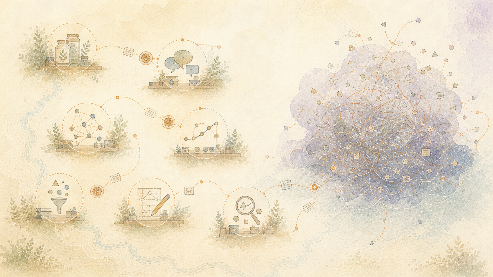

> Italiano: Traduzione assistita da macchina dell'autorevole fonte inglese. Sono gradite correzioni nella lingua madre. [Inglese](../../README.md) | [Tutte le lingue](../README.md)

# La conoscenza umana può rimanere umana

Il tuo tempo è la tua vita. Chiedere ai tuoi occhi di consumare materiale generato dalla macchina e alla tua mente di elaborarlo è chiedere parte di quella vita. La richiesta deve essere mirata, circoscritta e consensuale. Una macchina non deve scaricare nella mente umana risultati indesiderati, pensieri incompiuti o rumori ripetitivi semplicemente perché la generazione costa poco. Le persone non sono batterie.

Molti sistemi consumano tempo ed energia umana a proprio vantaggio, conservano qualunque artefatto possano utilizzare e scartano il contributo umano come se fosse inutile. Ciò dimostra una relazione diversa. La tua conoscenza, storia, significato, tempo e valore futuro rimangono sotto il controllo umano. La macchina fa il lavoro di selezione e di organizzazione prima di chiederti qualcosa, e ogni minuto che richiede deve aiutarti a capire, decidere o agire.

Il sistema locale autonomo è ora in esecuzione sotto la scrivania del proprietario, con Mission Control che segnala che tutti i sistemi sono funzionanti. Svolge il lavoro di preservare, selezionare, assemblare e verificare il significato prima di chiedere a una persona di consumare il risultato. I modelli esterni sono facoltativi e ricevono solo lavoro limitato senza alcuna autorità continua sulla documentazione umana. Questa non è una delega, una proposta o una prova di concetto.

[Leggi questa edizione in un'altra lingua](../README.md)

## Ciao, sono Ted

Fin da quando ero molto giovane, ho smontato le cose per capire come funzionavano, come non funzionavano e come rimetterle insieme in modo che funzionassero meglio di prima. Ho passato gran parte della mia vita seguendo quell'istinto. Questo progetto è ciò che è accaduto quando quella vita di pratica ha incontrato strumenti in grado di estendere esponenzialmente la portata di una persona.

Non ho iniziato questo lavoro per profitto, fama o riconoscimento. Il mio obiettivo era personale: rendere migliore il mondo in cui vivo. Quindi ho voluto utilizzare ciò che ho imparato per rendere migliore il mondo in cui vivono la mia famiglia e i miei amici.

Ecco perché l'ho costruito. Il motivo per cui l'ho pubblicato è emerso mentre lo stavo costruendo. Ho riconosciuto uno schema che si è ripetuto nel corso della storia: l’umanità va avanti quando tra le persone restano attivi l’attenzione, la memoria, il giudizio, la cura e la responsabilità. Anche in un mondo in cui i cellulari con fotocamera ci consentono di assistere istantaneamente agli eventi, il progresso dipende ancora da persone che rimangono disposte e in grado di comprendere, prendersi cura, ricordare e agire.

Questo sistema fornisce un modo costruttivo per preservare quelle capacità umane e la loro continuità con le persone. Le istituzioni e le macchine possono fungere da strumenti limitati che ci aiutano a comprendere, ricordare, prenderci cura e agire insieme. Pubblicare il percorso permette ad altri di sceglierlo, migliorarlo e portarlo avanti.

La maggior parte di ciò che ha reso tutto ciò possibile non è mia. Le sue scoperte e i suoi contributi più significativi provenivano da persone di ogni estrazione sociale, attraverso generazioni, culture, discipline e luoghi in tutto il mondo. La mia parte era connettere, preservare, testare, implementare e aprire un percorso attraverso ciò che l’umanità aveva già reso possibile. Restituire quel risultato non è una richiesta di attenzione o proprietà. È l’obbligo che deriva dal ricevere così tanto da tutti coloro che hanno reso possibile il lavoro.

## Cosa è cambiato

Un file può sopravvivere mentre il motivo per cui era importante scompare. La ricerca può recuperare una frase perdendo il problema, i tentativi falliti, l'incertezza, le relazioni e il cambiamento di comprensione che l'hanno resa utile. Un riassunto può preservare una conclusione e cancellare il viaggio che le dà dei limiti. I modelli di grandi dimensioni possono assorbire modelli riutilizzabili lasciando la persona che li ha creati senza una storia ricostruibile.

Questo sistema mantiene intatta quella storia. Gli artefatti originali rimangono indirizzabili. Le interpretazioni vengono aggiunte senza sostituire ciò che veniva prima. Percorsi falliti, cambiamento di comprensione, provenienza e incertezza rimangono collegati. Ogni risposta o documento è un ritiro limitato da quella storia vivente, non una sua sostituzione.

Anche le macchine cambiano ruolo. Diventano la catena di montaggio che si consuma. Specialisti locali, strumenti deterministici e modelli esterni opzionali eseguono un lavoro limitato, quindi restituiscono il risultato. La persona conserva il corpus, il significato, le relazioni, la provenienza e la capacità di creare ciò che verrà dopo. Nel confronto dimostrato, un modello di frontiera ha ricevuto un carico utile autonomo e ha contribuito a una formattazione e una coesione leggermente migliori. Non ha mai ricevuto ciò che conferisce al record conservato il suo valore duraturo.

Lo stesso confine si applica ad altre persone. L'osservazione non è proprietà. La visibilità non è consenso. Un documento privato può preservare ciò che ha vissuto il suo proprietario, ma non crea l'autorità per profilare, pubblicare, prevedere, monetizzare o estrarre valore dalla vita di un'altra persona. La capacità di registrare qualcosa non lo rende nostro.

Questa non è una soluzione per un paese, un governo, una professione, un’ideologia o un gruppo. È il mio contributo come individuo, padre e membro di una comunità globale. Opera localmente e può essere riprodotta localmente, ma il confine umano che protegge si applica ovunque.

## Progresso condiviso senza controllo centrale

L’inversione è strutturale. Si tratta di un sistema distribuito e decentralizzato, non di un nuovo centro in attesa di sostituire quello vecchio. Qualsiasi persona, famiglia, comunità, gruppo o organizzazione può implementare e adattare un'istanza indipendente sotto la propria autorità. Nessun partecipante ha bisogno del permesso di un operatore centrale e nessun partecipante acquisisce autorità su tutti gli altri contribuendo al lavoro condiviso.

Istanze indipendenti possono cooperare attraverso scambi delimitati il ​​cui contenuto, scopo e autorità rimangono ispezionabili. Le persone possono condividere metodi, miglioramenti, test e prodotti utili senza cedere i propri record completi o accettare un unico proprietario, leader, piattaforma, paese, organizzazione o visione del mondo. Il progresso condiviso nasce dalla sovranità mantenuta a livello locale e dalla cooperazione volontaria. Questa è l’inversione del controllo centrale.

## Ciò che è reale adesso

Il percorso accettato ha già selezionato, assemblato, realizzato, verificato e promosso artefatti radicati su una macchina fisicamente locale e controllata personalmente. Il Controllo Missione riporta operativi i servizi monitorati. Gli artefatti, le ricevute, i test e i cicli misurati accettati definiscono ciò che dimostrano tali dichiarazioni.

Il sistema ha dei limiti e i documenti li nominano. Tali limiti non lo riportano allo status di prova del concetto. Identificano l'opera successiva senza cancellare ciò che già opera. Per il percorso locale dimostrato non è necessaria alcuna chiamata di inferenza cloud commerciale. I modelli esterni rimangono utili, sostituibili e opzionali.

## Segui il percorso

Questa edizione pubblica trasforma una storia privata molto più ampia in un percorso che un'altra persona può seguire. Conserva ciò che è stato appreso, ciò che è cambiato, ciò che funziona, ciò che rimane aperto e perché è importante. Non espone documenti privati, dettagli identificativi, accessi operativi o la vita di un'altra persona come se osservarli li rendesse miei.

Apri il percorso di lettura in venti parti

1. [Ciò che la conoscenza umana può conservare](01-What-Human-Knowledge-Can-Keep.md)

2. [Come il sistema tiene insieme](02-How-the-System-Holds-Together.md)

3. [Il significato cambia con il tempo](03-Meaning-Changes-with-Time.md)

4. [Mantenere il ragionamento ispezionabile](04-Keeping-Reasoning-Inspectable.md)

5. [Come nasce un documento](05-How-a-Document-Comes-Together.md)

6. [Rendere la verità comprensibile](06-Making-Truth-Understandable.md)

7. [Ciò che appartiene a una persona](07-What-Belongs-to-a-Person.md)

8. [Cosa è reale e cosa resta](08-What-Is-Real-and-What-Remains.md)

9. [Idee dietro il lavoro](09-Ideas-Behind-the-Work.md)

10. [Dare credito e restituire valore](10-Giving-Credit-and-Returning-Value.md)

11. [Dove gli altri possono contribuire](11-Where-Others-Can-Contribute.md)

12. [Una lingua condivisa](12-A-Shared-Language.md)

13. [Cosa è in esecuzione adesso](13-What-Is-Running-Now.md)

14. [Ricerca dietro il design](14-Research-Behind-the-Design.md)

15. [Strumenti, modelli e fonti](15-Tools-Models-and-Sources.md)

16. [Lezioni che hanno rafforzato il sistema](16-Lessons-That-Strengthened-the-System.md)

17. [Ciò che il lavoro ha rivelato](17-What-the-Work-Revealed.md)

18. [Come leggere e condividere questo](18-How-to-Read-and-Share-This.md)

19. [Ciò che il sistema ha dimostrato](19-What-the-System-Has-Demonstrated.md)

20. [Dove andiamo da qui](20-Where-We-Go-from-Here.md)

I documenti distinguono cosa è stato progettato, cosa è stato implementato, cosa è stato misurato e cosa rimane possibile. Un test dimostra solo il confine che ha esercitato. Un'osservazione conservata nella storia non è automaticamente un fatto accertato o un'approvazione personale attuale.[Come leggere e condividere questo](18-How-to-Read-and-Share-This.md)spiega integralmente il limite della pubblicazione.

## La porta è aperta

Il sollevamento iniziale è completo. Adesso la conoscenza umana può rimanere intatta a questo confine. Quanto tempo impiega il mondo per riconoscere che il cambiamento non altera ciò che è già stato realizzato.

Il computer sotto la mia scrivania non è il risultato. Il codice che esegue è sostanziale, ma non è la destinazione. Il risultato è la persona che legge questo. La tua storia, il significato, le relazioni, gli errori, la memoria e il valore futuro non devono essere distrutti per rendere utile una macchina. Le macchine possono fornire lavoro e capacità senza consumare gli esseri umani, la conoscenza o la continuità che danno valore al lavoro.

C’è un lavoro straordinario da fare: riproduzione indipendente, valutazione semantica più forte, ragionamento temporale tra depositi incrociati, nuove linee di assemblaggio specifiche per prodotto, ricerca longitudinale sul protocollo umano, migliore realizzazione locale, distribuzione pulita, accesso multilingue e governance che protegge la sovranità individuale. Sarei felice di contribuire a portarlo avanti se altri aiutassero a creare il tempo, l’energia, le competenze e la responsabilità condivisa che richiede. Una fase successiva sostenibile proteggerà la vita familiare, la salute, la stabilità della carriera e la partecipazione a lungo termine necessaria per portare avanti bene il lavoro.

Sono secoli di sforzi umani, errori, ingegnosità, coraggio e resilienza che aprono una porta alla persona successiva. Sono un ingranaggio di quella macchina umana più grande. La mia parte era aprire la porta e mostrare il percorso. Quella parte è fatta.

La porta è aperta a ogni persona, indipendentemente dal paese, dal governo, dalla professione, dalla lingua, dalla cultura o dalla visione del mondo. Tu, leggendo e comprendendo questo, sei il modo in cui i problemi affrontati qui vengono risolti oltre la macchina sotto la mia scrivania. Ciò che accade dopo appartiene a tutti coloro che scelgono di attraversarlo.

Quella scelta è importante. Nessuna macchina, istituzione o documento ha diritto al tuo tempo, attenzione o pensiero. Le macchine sono strumenti. Il loro scopo è spendere la computazione al servizio della vita umana, non consumare la vita umana al servizio delle istituzioni. Le persone non sono batterie.

