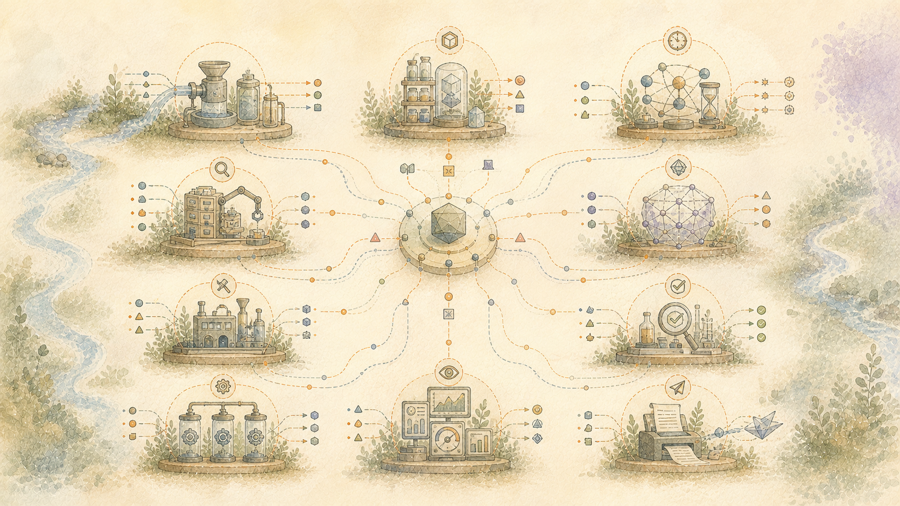

> 日本語: 信頼できる英語ソースの機械翻訳。母国語による修正は大歓迎です。 [英語](../../README.md) | [すべての言語](../README.md)

# 今何が動いているのか

## このカタログの見方

カタログは、Mission Control のデータセンター ビューの公開版です。プライベート アドレス、マシン レイアウト、資格情報、ファイル パス、または動作リズムを公開することなく、各歯車が何を提供するのか、また歯車が消滅すると何が失われるのかについて説明します。ライブ グラフは依然として信頼できる運用上の情報源です。

コンポーネントのステータスは重要です。ツールは、アクティブである場合、ソース システムとして保持される場合、評価されたが採用されない場合、または廃止された先行製品である場合があります。このカタログに存在しても、コンポーネントにその規定された役割を超える権限が付与されることはありません。

このルールには外部フロンティア機能が含まれます。使用すると、有界ステーションを占有し、維持されているコーパスへの無制限のアクセスではなく、専用のペイロードを受け取ります。ペイロードは宣言された操作をサポートしますが、より広範なシステムを再構築したり、将来の引き出しを個別に生成したりするために必要な永続的な状態を省略します。ステーションは仕事を受け取りますが、中央機関が永続的な価値を抽出できる人間の記録の保管ではありません。

## システムへの侵入およびシステムを迂回する経路

### ロボットブレイン (LibreChat)

**責任。** 交換可能な人間に面した会話ウィンドウを提供します。永続的なメモリ、取得、推論、検証がその下のサービスに残されている間、リクエストと応答を伝送します。

**保存する必要があります。** 正確なグラフの同一性、関係の出所、および宣言されたコンポーネントの境界。

**リソースの形状。** ライブ デプロイメントでは、実際の CPU、メモリ、ストレージ、アクセラレータ、およびリースの使用状況が記録されます。この公開カタログでは、マシンの配置は公開されません。

**境界。** 宣言されたグラフ責任のみを実行することができ、欠落ま​​たはサポートされていない上流の証拠を修復することはできません。

**主な公開ツール。**[リブレチャット](https://github.com/danny-avila/LibreChat)、[Node.js](https://github.com/nodejs/node)

### 会話スプリッター

**責任。** チャットが 2 つの主題になったときに通知し、完了した主題を別々にファイルするよう提案します。

**保存する必要があります。** 正確なグラフの同一性、関係の出所、および宣言されたコンポーネントの境界。

**リソースの形状。** ライブ デプロイメントでは、実際の CPU、メモリ、ストレージ、アクセラレータ、およびリースの使用状況が記録されます。この公開カタログでは、マシンの配置は公開されません。

**境界。** 宣言されたグラフ責任のみを実行することができ、欠落ま​​たはサポートされていない上流の証拠を修復することはできません。

**主な公開ツール。**[ファストAPI](https://github.com/fastapi/fastapi)

### ミッションコントロール

**責任。** マシン上のウィンドウ: 何が実行されているのか、何が注意を必要としているのか、そしてマシンが現在何をしているのか。この発行境界では、そのステータス ページで、ローカル インストール上で動作しているすべての監視対象システムが報告されます。

**保存する必要があります。** 正確なグラフの同一性、関係の出所、および宣言されたコンポーネントの境界。

**リソースの形状。** ライブ デプロイメントでは、実際の CPU、メモリ、ストレージ、アクセラレータ、およびリースの使用状況が記録されます。この公開カタログでは、マシンの配置は公開されません。

**境界。** 運用ステータスはサービス状態を報告します。受け入れられた成果物と受領書は、個別の実行と意味論的な証拠の境界を確立します。

**主な公開ツール。**[ファストAPI](https://github.com/fastapi/fastapi)、[グラフビズ](https://gitlab.com/graphviz/graphviz)、[サイコプ](https://github.com/psycopg/psycopg)

### セマンティックルーター

**責任。** 制限されたリクエストを適切なローカル エンジンにルーティングし、外部推論を使用する前に明示的な承認を必要とします。高価な機能は、要求が測定されたコストに見合った場合にのみ選択されます。

**保存する必要があります。** 正確なグラフの同一性、関係の出所、および宣言されたコンポーネントの境界。

**リソースの形状。** ライブ デプロイメントでは、実際の CPU、メモリ、ストレージ、アクセラレータ、およびリースの使用状況が記録されます。この公開カタログでは、マシンの配置は公開されません。

**境界。** 宣言されたグラフ責任のみを実行することができ、欠落ま​​たはサポートされていない上流の証拠を修復することはできません。

**主な公開ツール。**[ファストAPI](https://github.com/fastapi/fastapi)。 Envoy および vLLM セマンティック ルーターは、現在のランタイム依存関係ではなく、検査済みまたは廃止された先行製品としてソース インデックスにクレジットされたままになります。

### 完全なエージェント履歴

**責任。** 人間のターン、アシスタントのターン、ツール、エラー、修正など、完全で順序付けられたエージェント イベント ストリームをインタラクションの証拠として保存します。歴史は何が起こったかを記録します。エージェントの発言を検証された事実にするものではありません。

**保存する必要があります。** 正確なグラフの同一性、関係の出所、および宣言されたコンポーネントの境界。

**リソースの形状。** ライブ デプロイメントでは、実際の CPU、メモリ、ストレージ、アクセラレータ、およびリースの使用状況が記録されます。この公開カタログでは、マシンの配置は公開されません。

**境界。** 情報源と出所が確立しているもののみを提供します。下流側の解釈は分離されたままになります。

### プロジェクトドキュメント

**責任。** プラットフォームが存在する理由とそのアーキテクチャがどのように変更されたかを説明する非公開の設計、証拠、プロジェクト記録を保存してください。パブリック製品は、プライベートなドキュメントの場所を公開するのではなく、レビューされた派生物を使用します。

**保存する必要があります。** 正確なグラフの同一性、関係の出所、および宣言されたコンポーネントの境界。

**リソースの形状。** ライブ デプロイメントでは、実際の CPU、メモリ、ストレージ、アクセラレータ、およびリースの使用状況が記録されます。この公開カタログでは、マシンの配置は公開されません。

**境界。** 情報源と出所が確立しているもののみを提供します。下流側の解釈は分離されたままになります。

### ヴィクンジャ

**責任。** 外部タスク システムを、プラットフォーム以前から独立して所有されているソースとして保持します。統合により、タスク システムをコーパスに吸収したり、そのライフサイクルを変更したりすることなく、承認されたタスクの証拠を読み取ることができます。

**保存する必要があります。** 正確なグラフの同一性、関係の出所、および宣言されたコンポーネントの境界。

**リソースの形状。** ライブ デプロイメントでは、実際の CPU、メモリ、ストレージ、アクセラレータ、およびリースの使用状況が記録されます。この公開カタログでは、マシンの配置は公開されません。

**境界。** 情報源と出所が確立しているもののみを提供します。下流側の解釈は分離されたままになります。

**主な公開ツール。**[ヴィクンジャ](https://github.com/go-vikunja/vikunja)

## 保存と検索

### 知識の摂取

**責任。** 物事が入り込む方法。文書、エクスポート、メモの山をドロップすると、どこにもないのではなく、見つけられる場所に落ちます。

**保存する必要があります。** 正確なグラフの同一性、関係の出所、および宣言されたコンポーネントの境界。

**リソースの形状。** ライブ デプロイメントでは、実際の CPU、メモリ、ストレージ、アクセラレータ、およびリースの使用状況が記録されます。この公開カタログでは、マシンの配置は公開されません。

**境界。** 宣言されたグラフ責任のみを実行することができ、欠落ま​​たはサポートされていない上流の証拠を修復することはできません。

### モンゴDB

**責任。** 言われたとおりに会話自体を保持します。

**保存する必要があります。** 正確なグラフの同一性、関係の出所、および宣言されたコンポーネントの境界。

**リソースの形状。** ライブ デプロイメントでは、実際の CPU、メモリ、ストレージ、アクセラレータ、およびリースの使用状況が記録されます。この公開カタログでは、マシンの配置は公開されません。

**境界。** 可用性と完全性が必要です。保存されたデータ自体は解釈または検証されません。

**主な公開ツール。**[モンゴDB](https://github.com/mongodb/mongo)

### PostgreSQL

**責任** 代替可能なアプリケーション サービスを存続させるために、耐久性のある構造化されたプロジェクト レコード、派生状態、および検索インデックスを保持します。保存された記録は、未分化の 1 つの記憶になるのではなく、明確な権威と来歴を保持します。

**保存する必要があります。** 正確なグラフの同一性、関係の出所、および宣言されたコンポーネントの境界。

**リソースの形状。** ライブ デプロイメントでは、実際の CPU、メモリ、ストレージ、アクセラレータ、およびリースの使用状況が記録されます。この公開カタログでは、マシンの配置は公開されません。

**境界。** 可用性と完全性が必要です。保存されたデータ自体は解釈または検証されません。

**主な公開ツール。**[PostgreSQL](https://github.com/postgres/postgres)、[ベクター](https://github.com/pgvector/pgvector)

## 推論と再構築

### 引数関係分類子

固定された AMF_ARI OpenVINO CPU の推論、競合、言い換え、または無関係の分類

**責任。** 提供された 2 つの命題間の関係を分類します。命題を作成したり、個人的な動機を推測したりするものではありません。例: 別のステートメントをサポートするステートメントと、それと矛盾するステートメントを区別するか、サポートされている関係を返しません。

**保存する必要があります。** 正確なグラフの同一性、関係の出所、および宣言されたコンポーネントの境界。

**リソースの形状。** ライブ デプロイメントでは、実際の CPU、メモリ、ストレージ、アクセラレータ、およびリースの使用状況が記録されます。この公開カタログでは、マシンの配置は公開されません。

**境界。** 宣言されたグラフ責任のみを実行することができ、欠落ま​​たはサポートされていない上流の証拠を修復することはできません。

**主な公開ツール。**[AMF ARI RoBERTa OpenVINOモデル](https://huggingface.co/arg-tech/amf-ari-roberta-ov-int8)

### 人間の人工物

**責任。** 組立ラインで構築できる人に面する製品を定義します。各製品には、1 つの一般的な概要を共有するのではなく、独自の受信者、目的、構造、証拠ポリシー、および配信契約が含まれています。

**保存する必要があります。** 正確なグラフの同一性、関係の出所、および宣言されたコンポーネントの境界。

**リソースの形状。** ライブ デプロイメントでは、実際の CPU、メモリ、ストレージ、アクセラレータ、およびリースの使用状況が記録されます。この公開カタログでは、マシンの配置は公開されません。

**境界。** 宣言されたグラフ責任のみを実行することができ、欠落ま​​たはサポートされていない上流の証拠を修復することはできません。

### 接地 + 配送の検証

忠実性、出所、紛失、発明、織物、および理解チェックに関する独立した受領ゲート

**責任** リリース前に、アーティファクトがサポートされている意味を保持し、宣言された配信契約を満たしていることを独立してチェックします。例: 結論をでっち上げた読みやすい段落を拒否し、対象読者にとって使用できない構造の根拠のある文書を個別に拒否します。

**保存する必要があります。** 正確なグラフの同一性、関係の出所、および宣言されたコンポーネントの境界。

**リソースの形状。** ライブ デプロイメントでは、実際の CPU、メモリ、ストレージ、アクセラレータ、およびリースの使用状況が記録されます。この公開カタログでは、マシンの配置は公開されません。

**境界。** 宣言されたグラフ責任のみを実行することができ、欠落ま​​たはサポートされていない上流の証拠を修復することはできません。

### 視聴者の解像度

受信機の状態、前提条件、レジスタ、および関連性

**責任。** 想定を明示的に保ちながら、対象となる受信者が知っておくべきこと、必要とすること、許容することを期待されることを説明します。例: プール技術者に馴染みのある略語を使用する前に、住宅所有者ガイドに pH について説明するよう要求します。

**保存する必要があります。** 正確なグラフの同一性、関係の出所、および宣言されたコンポーネントの境界。

**リソースの形状。** ライブ デプロイメントでは、実際の CPU、メモリ、ストレージ、アクセラレータ、およびリースの使用状況が記録されます。この公開カタログでは、マシンの配置は公開されません。

**境界。** 宣言されたグラフ責任のみを実行することができ、欠落ま​​たはサポートされていない上流の証拠を修復することはできません。

### ツリー全体の崩壊 + パケット

コンテナ制約のあるパーティション、選択、利益、損失

**責任** 省略されたものを記録し、ツリーの意味のある形状を維持しながら、要求された成果物に適合するものを選択してバランスをとります。例: 最大のソース ブランチに予算全体を消費させるのではなく、各主要ブランチを 1,000 ワードの記事で表すようにします。

**保存する必要があります。** 正確なグラフの同一性、関係の出所、および宣言されたコンポーネントの境界。

**リソースの形状。** ライブ デプロイメントでは、実際の CPU、メモリ、ストレージ、アクセラレータ、およびリースの使用状況が記録されます。この公開カタログでは、マシンの配置は公開されません。

**境界。** 宣言されたグラフ責任のみを実行することができ、欠落ま​​たはサポートされていない上流の証拠を修復することはできません。

**主な公開ツール。**[サブモジュールライブラリ](https://github.com/decile-team/submodlib)、[膝をついた](https://github.com/arvkevi/kneed)

### コンパクトなワーキングモデル

選択されたユニット、関係、軌跡、ソース ブロック、計画、ハンドル、およびハンドオフ台帳用のポータブルなリクエスト スコープのキャリア

**責任。** 選択した事実、関係、年表、不確実性、失敗、およびソース ハンドルを移植可能なジョブ固有のコンテキストにパッケージ化します。例: エディターにプール保守チェーンと、そのステップがコーパス全体をロードしたりリンクを削除せずに接続する理由を与えます。

**保存する必要があります。**source_spans; relation_ids;年表; uncertainty; failures; supersession; unknowns

**リソースの形状。** CPU と RAM は限定された選択に比例します。 GPUもリースもなし

**境界。** 品質は上流関係と預金国の適用範囲によって制限されます。

### 配信メカニズム

レジスタ、モード、ウィーブプロファイル、ペーシング、密度、およびデスロップコントロール

**責任。** この製品と視聴者に対して、ペース、密度、レジスター、ウィーブ軌道などの測定された配信制約を提供します。例: 基礎となる事実を変更せずに、子供たちに短いパケットと技術レポートとは異なる繰り返しパターンを説明します。

**保存する必要があります。** 正確なグラフの同一性、関係の出所、および宣言されたコンポーネントの境界。

**リソースの形状。** ライブ デプロイメントでは、実際の CPU、メモリ、ストレージ、アクセラレータ、およびリースの使用状況が記録されます。この公開カタログでは、マシンの配置は公開されません。

**境界。** 宣言されたグラフ責任のみを実行することができ、欠落ま​​たはサポートされていない上流の証拠を修復することはできません。

### 談話の前処理

正確な境界付きスライス、FastCoref 参照候補、およびリースされた isanlp RST オペランド リンク

**責任** 正確なソース座標を維持しながら、分類を推論する前に、候補となる指示対象と談話範囲を特定します。例: 「it」を名前付きポンプ候補にリンクし、因果関係によって結合された 2 つの文節を公開します。

**保存する必要があります。** 正確なグラフの同一性、関係の出所、および宣言されたコンポーネントの境界。

**リソースの形状。** ライブ デプロイメントでは、実際の CPU、メモリ、ストレージ、アクセラレータ、およびリースの使用状況が記録されます。この公開カタログでは、マシンの配置は公開されません。

**境界。** 宣言されたグラフ責任のみを実行することができ、欠落ま​​たはサポートされていない上流の証拠を修復することはできません。

**主な公開ツール。**[IsaNLP RST](https://github.com/tchewik/isanlp_rst)、[ファストコアフ](https://github.com/shon-otmazgin/fastcoref)

### アーティファクト全体の前方再構成

前提条件、指示対象、因果関係、進行、導入、結論

**責任** 読者の順序に従って選択した資料を再構築し、前提条件、指示対象、因果関係、進行状況、および正直な結末を復元します。例: 手順の前に目標を紹介し、結論が存在しない場合は未解決の質問を終了します。

**保存する必要があります。** 正確なグラフの同一性、関係の出所、および宣言されたコンポーネントの境界。

**リソースの形状。** ライブ デプロイメントでは、実際の CPU、メモリ、ストレージ、アクセラレータ、およびリースの使用状況が記録されます。この公開カタログでは、マシンの配置は公開されません。

**境界。** 宣言されたグラフ責任のみを実行することができ、欠落ま​​たはサポートされていない上流の証拠を修復することはできません。

### グラフの理由と依存関係の予測

新しい推論主張を導入できない、分類されたグラフ エッジの決定論的なビュー

**責任。** 解釈を追加せずに、受け入れられた関係エッジを検査可能な依存関係と理由ビューに変換します。例: 正確に分類されたエッジが存在するため、結論 B が前提 A に依存することを示します。

**保存する必要があります。** 正確なグラフの同一性、関係の出所、および宣言されたコンポーネントの境界。

**リソースの形状。** ライブ デプロイメントでは、実際の CPU、メモリ、ストレージ、アクセラレータ、およびリースの使用状況が記録されます。この公開カタログでは、マシンの配置は公開されません。

**境界。** 宣言されたグラフ責任のみを実行することができ、欠落ま​​たはサポートされていない上流の証拠を修復することはできません。

**主な公開ツール。**[ネットワークX](https://github.com/networkx/networkx)

### グラウンディングされたインタラクティブな回答

**責任。** 関連する推論、出所、不確実性、展開経路を含む会話形式の回答を返します。回答パスは、文書生成の実行を装うことなく、完全な会話と証拠のライフサイクルを横断する場合があります。

**保存する必要があります。** 正確なグラフの同一性、関係の出所、および宣言されたコンポーネントの境界。

**リソースの形状。** ライブ デプロイメントでは、実際の CPU、メモリ、ストレージ、アクセラレータ、およびリースの使用状況が記録されます。この公開カタログでは、マシンの配置は公開されません。

**境界。** 宣言されたグラフ責任のみを実行することができ、欠落ま​​たはサポートされていない上流の証拠を修復することはできません。

### ヒューマン・プロトコル・ブリッジ

サポートされている固定ペイロードの受信者指向のエンコーディング

**責任。** 製品契約と測定された配信パターンを使用して、サポートされている固定ペイロードを対象者が従うことができる形式に変換します。証拠を変えることはできません。例: 結論ではなく配信構造を変更することで、同じ根拠のある推論チェーンを簡潔な電子メールまたは段階的なガイドに変換します。

**保存する必要があります。** 正確なグラフの同一性、関係の出所、および宣言されたコンポーネントの境界。

**リソースの形状。** ライブ デプロイメントでは、実際の CPU、メモリ、ストレージ、アクセラレータ、およびリースの使用状況が記録されます。この公開カタログでは、マシンの配置は公開されません。

**境界。** 宣言されたグラフ責任のみを実行することができ、欠落ま​​たはサポートされていない上流の証拠を修復することはできません。

### インタラクティブなコンテキストアセンブリ

**責任。** 現在の質問に対する限定された証拠と推論グラフを構築し、時系列、修正、失敗、ソース ID、および承認を維持します。コーパスを検索スニペットにフラット化することなく、回答にコンテキストを提供します。

**保存する必要があります。** 正確なグラフの同一性、関係の出所、および宣言されたコンポーネントの境界。

**リソースの形状。** ライブ デプロイメントでは、実際の CPU、メモリ、ストレージ、アクセラレータ、およびリースの使用状況が記録されます。この公開カタログでは、マシンの配置は公開されません。

**境界。** 宣言されたグラフ責任のみを実行することができ、欠落ま​​たはサポートされていない上流の証拠を修復することはできません。

### ロスレス加入

**責任** 解釈する前に元のバイトとネイティブ イベントを認め、観察された到着事実のみを記録します。コンテンツ、アイデンティティ、および関係から推測される説明、タイムスタンプは、別個のバージョン管理された観察のままになります。

**保存する必要があります。** 正確なグラフの同一性、関係の出所、および宣言されたコンポーネントの境界。

**リソースの形状。** ライブ デプロイメントでは、実際の CPU、メモリ、ストレージ、アクセラレータ、およびリースの使用状況が記録されます。この公開カタログでは、マシンの配置は公開されません。

**境界。** 宣言されたグラフ責任のみを実行することができ、欠落ま​​たはサポートされていない上流の証拠を修復することはできません。

### 一次証拠

**責任。** 後の表現や製品が追跡できる必要がある信頼できる寄託物を保持します。システムがそれらの意味や関係をまだ説明できない場合でも、それらの存在には価値があります。

**保存する必要があります。** 正確なグラフの同一性、関係の出所、および宣言されたコンポーネントの境界。

**リソースの形状。** ライブ デプロイメントでは、実際の CPU、メモリ、ストレージ、アクセラレータ、およびリースの使用状況が記録されます。この公開カタログでは、マシンの配置は公開されません。

**境界。** 宣言されたグラフ責任のみを実行することができ、欠落ま​​たはサポートされていない上流の証拠を修復することはできません。

### 完全な暫定ツリー

枝刈り前の完全な証拠、依存関係、代替構造、および障害構造

**責任。** 代替案、失敗、未知のもの、置き換えられたビューを含む完全なリクエスト スコープの候補ツリーを保持し、崩壊時に何が失われるかを確認できるようにします。例: ガイドの材料を選択する前に、失敗した治療とその後の修正の両方を保存します。

**保存する必要があります。** 正確なグラフの同一性、関係の出所、および宣言されたコンポーネントの境界。

**リソースの形状。** ライブ デプロイメントでは、実際の CPU、メモリ、ストレージ、アクセラレータ、およびリースの使用状況が記録されます。この公開カタログでは、マシンの配置は公開されません。

**境界。** 宣言されたグラフ責任のみを実行することができ、欠落ま​​たはサポートされていない上流の証拠を修復することはできません。

### 推論グラフ

年表、型付き関係、クレームのライフサイクル、失敗、不確実性

**責任。** 提案、時系列、試み、結果、競合、依存関係、および不確実性のリクエスト範囲のマップを維持します。例: どちらの状態も削除せずに、失敗した処理を、それを置き換える修正に接続します。

**保存する必要があります。** 正確なグラフの同一性、関係の出所、および宣言されたコンポーネントの境界。

**リソースの形状。** ライブ デプロイメントでは、実際の CPU、メモリ、ストレージ、アクセラレータ、およびリースの使用状況が記録されます。この公開カタログでは、マシンの配置は公開されません。

**境界。** 宣言されたグラフ責任のみを実行することができ、欠落ま​​たはサポートされていない上流の証拠を修復することはできません。

### リクエスト + アーティファクト契約

目的、受信者、コンテナ、チャネル、予算、真実性

**責任** 目的、受信者、製品、チャネル、予算、真実の基準を固定して、下流のすべての歯車が同じ仕事を解決できるようにします。例: 証拠の選択を開始する前に、500 ワードの一般読者向けの説明と技術的なインシデントの報告を区別します。

**保存する必要があります。** 正確なグラフの同一性、関係の出所、および宣言されたコンポーネントの境界。

**リソースの形状。** ライブ デプロイメントでは、実際の CPU、メモリ、ストレージ、アクセラレータ、およびリースの使用状況が記録されます。この公開カタログでは、マシンの配置は公開されません。

**境界。** 宣言されたグラフ責任のみを実行することができ、欠落ま​​たはサポートされていない上流の証拠を修復することはできません。

### 逆展開

剪定せずに後方に集めます。限界寄与度を測定する

**責任。** リクエストまたはその後の証拠から以前の関連記録に向かって進み、何も破棄される前に完全な候補者の行程を収集します。例: 現在の藻類に関する質問を、以前の pH、プール サイズ、メンテナンス、および使用状況の記録に遡って追跡します。

**保存する必要があります。** 正確なグラフの同一性、関係の出所、および宣言されたコンポーネントの境界。

**リソースの形状。** ライブ デプロイメントでは、実際の CPU、メモリ、ストレージ、アクセラレータ、およびリースの使用状況が記録されます。この公開カタログでは、マシンの配置は公開されません。

**境界。** 宣言されたグラフ責任のみを実行することができ、欠落ま​​たはサポートされていない上流の証拠を修復することはできません。

### 型付けされたレトリックの動き

セマンティックなジョブと依存関係、見出し部分文字列は使用しない

**責任。** 選択した各ユニットに、一致する見出し語ではなく、製品契約に基づいてコミュニケーション ジョブと依存関係を割り当てます。例: 両方を「背景」と呼ぶのではなく、証拠を主張を裏付けるものとしてマークし、失敗を回復の準備としてマークします。

**保存する必要があります。** 正確なグラフの同一性、関係の出所、および宣言されたコンポーネントの境界。

**リソースの形状。** ライブ デプロイメントでは、実際の CPU、メモリ、ストレージ、アクセラレータ、およびリースの使用状況が記録されます。この公開カタログでは、マシンの配置は公開されません。

**境界。** 宣言されたグラフ責任のみを実行することができ、欠落ま​​たはサポートされていない上流の証拠を修復することはできません。

### 意味論的再構築

実体、提案、エピソード、試み、結果、質問

**責任。** 最終的な重要性や表現を決定することなく、ソース観察を属性付きの意味論的オブジェクトに変換します。例: 提案された修正、試行、その失敗、および残りの質問を個別のリンクされたレコードとして表します。

**保存する必要があります。** 正確なグラフの同一性、関係の出所、および宣言されたコンポーネントの境界。

**リソースの形状。** ライブ デプロイメントでは、実際の CPU、メモリ、ストレージ、アクセラレータ、およびリースの使用状況が記録されます。この公開カタログでは、マシンの配置は公開されません。

**境界。** 宣言されたグラフ責任のみを実行することができ、欠落ま​​たはサポートされていない上流の証拠を修復することはできません。

### バージョン付きの表現

**責任。** トランスクリプト、構造、テキスト、OCR、レイアウト、および派生ビュー

**保存する必要があります。** 正確なグラフの同一性、関係の出所、および宣言されたコンポーネントの境界。

**リソースの形状。** ライブ デプロイメントでは、実際の CPU、メモリ、ストレージ、アクセラレータ、およびリースの使用状況が記録されます。この公開カタログでは、マシンの配置は公開されません。

**境界。** 宣言されたグラフ責任のみを実行することができ、欠落ま​​たはサポートされていない上流の証拠を修復することはできません。

### なぜそれが重要なのか

原因となる動機、懸念、結果、および現在の関連性

**責任** 裏付けのない理由は不明のまま、なぜ注目が集まったのかについて直接的かつ明示的に証明された証拠を携行します。例: 技術的な質問だけからその動機を推測するのではなく、記録がそれを裏付ける場合、共有機器を使用する人々を保護するため、メンテナンス作業が重要であることを保持します。

**保存する必要があります。** 正確なグラフの同一性、関係の出所、および宣言されたコンポーネントの境界。

**リソースの形状。** ライブ デプロイメントでは、実際の CPU、メモリ、ストレージ、アクセラレータ、およびリースの使用状況が記録されます。この公開カタログでは、マシンの配置は公開されません。

**境界。** 宣言されたグラフ責任のみを実行することができ、欠落ま​​たはサポートされていない上流の証拠を修復することはできません。

### 推論 + アーティファクト エンジン

レシートゲート型再構成、崩壊、ヒューマン プロトコル、およびアトミック マークダウン レンダリング

**責任。** 境界のある再構築およびレンダリング パスを調整し、各ステージの受信を公開します。専門家の判断に代わるものではありません。例: 選択、計画、実現、検証、アトミック書き込みを通じて作成リクエストを実行します。

**保存する必要があります。** 正確なグラフの同一性、関係の出所、および宣言されたコンポーネントの境界。

**リソースの形状。** ライブ デプロイメントでは、実際の CPU、メモリ、ストレージ、アクセラレータ、およびリースの使用状況が記録されます。この公開カタログでは、マシンの配置は公開されません。

**境界。** 宣言されたグラフ責任のみを実行することができ、欠落ま​​たはサポートされていない上流の証拠を修復することはできません。

### アセンブリ + 機能マネージャー

必須フィールドを後方へ遡り、前提条件の価格を設定し、真実の専門家を選択し、依存関係ウェーブを注文し、ゼロ値の作業をスキップします。

**責任。** どの専門家が必要か、どの順序で作業を行うか、どの作業が価値を付加しないかを選択します。それは彼らの仕事を遂行しません。例: 文の実現前に関係の実現をスケジュールし、必要なものを何も提供しない使用できない文体パスをスキップします。

**保存する必要があります。**must_preserve_fields;フィールドリネージ;明示的な使用不可

**リソースの形状** CPU。記憶力が低い。 GPUもリースもなし

**境界。** コストと価値の観察は意思決定を明らかにしますが、人間の重要性を定義することはありません

### 原子キャリアの予算調整者

実現前に分割できないソース、接着剤、関係キャリアを測定し、固定された製品全体の予算を本物のセクションのスラックによって再分配します

**責任。** 分割できない事実と関係キャリアが各セクションに適合するかどうかを確認し、ドキュメントの総予算を維持しながら、利用可能な余裕のみを移動します。例: 必要な 120 ワードのアトミック命令を含む 90 ワードのプロシージャ セクションを、別のセクションから未使用のワードを借用して拡大します。

**保存する必要があります。** Whole_artifact_budget; required_rhetorical_jobs;ソース権限;グラフの形状

**リソースの形状** CPU。実行時間はほぼゼロ。無駄なステージ 8 GPU/モデル/検証作業を防止します

**Boundary.** は分割不可能な命題を圧縮できません。必要なすべてのキャリアが宣言された製品予算を超える場合は失敗します

### ソースバインド再バインディングマネージャー

割り当てられた製品ジョブに互換性がなく、1 つの宛先が互換性があることが証明されている場合、完全に分離されたブランチのみを移動します。

**責任。** 完全で独立した証拠ブランチを、曖昧な移動や関連性のある移動を拒否しながら、そのジョブが正当に使用できる 1 つのセクションに移動します。例: セットアップからトラブルシューティングまでの自己完結型リカバリ メモを、両方のセクションで重複せずに再割り当てします。

**保持する必要があります。** Branch_identity;ソーススパン;関係ID; marginal_gain_ledger

**リソースの形状** CPU。低遅延。 GPUもリースもなし

**Boundary.** は、関係性のある、曖昧な、部分的な、または容量を超える移動を拒否します。

### ドキュメント全体のリレーション リアライザー

受け入れられた同一セクションおよび断面推論エッジを、両方のオペランドを繰り返すことなく、コンパクトで独立して再生可能な接続言語に変換します。

**責任** 方向、オペランド、およびソース スパンを独立して再生可能に保ちながら、受け入れられたグラフ関係を短い接続言語に変換します。例: A と B を無関係な隣接する事実として出力するのではなく、A-原因-B を境界のある因果ブリッジとして実現します。

**保持する必要があります。** relationship_direction;オペランド_アイデンティティ;正確なキャリアスパン;ソーススパン;セクションリネージュ

**リソースの形状** CPU。実行時間はほぼゼロ。 GPUもリースもなし

**Boundary.** は、明示的に受け入れられた関係の種類のみを実現します。コンパクトなブリッジは、型付けされたエッジのアイデンティティを保持しますが、機械的に表現されたままになります。同じキャリア、あいまい、暗黙的、未知のエッジはグラフ内に表示されたままですが、散文として主張されません

### ナレッジエンジン

**責任。** これらの責任を 1 つの真実の状態に統合することなく、登録、派生表現、検索、来歴、永続的なジョブを調整します。サポートされているインターフェイスを消費者に公開しながら、主要な証拠は独立してアドレス指定可能のままです。

**保存する必要があります。** 正確なグラフの同一性、関係の出所、および宣言されたコンポーネントの境界。

**リソースの形状。** ライブ デプロイメントでは、実際の CPU、メモリ、ストレージ、アクセラレータ、およびリースの使用状況が記録されます。この公開カタログでは、マシンの配置は公開されません。

**境界。** 宣言されたグラフ責任のみを実行することができ、欠落ま​​たはサポートされていない上流の証拠を修復することはできません。

### 型付き条項 / 文マイクロプランナー

ソースバインドされたキャリアをタイプされた修辞ジョブに割り当て、条項、文、および段落プランを編集します

**責任。** ソースバインディングを維持しながら、承認された意味と関係を節、文、および段落のジョブに分割します。言葉遣いや主張を発明するものではありません。例: 原因節を計画し、その後にその結果と表面実現器の移行を計画します。

**保持する必要があります。** semantic_unit_ids;関係ID;ソースフォーム

**リソースの形状** CPU。低遅延。 GPUもリースもなし

**Boundary.** は、欠落している命題を発明したり、未分類の関係を修復したりするものではありません

**主な公開ツール。**[スペイシー](https://github.com/explosion/spaCy)、[ブリングファイア](https://github.com/microsoft/BlingFire)

### 製品契約マネージャー

ジャンル、受信者、目的、チャネル、真実性、注目度、予算を必要な製品分野と修辞的作業に変換します。

**責任** 証拠を選択したり文書化したりすることなく、リクエストを最終製品の具体的なチェックリストに変換します。例: ユーザーマニュアルの場合、前提条件、順序付けられたアクション、回復ガイダンス、およびエディターを開始する前に閉じることを要求します。

**保持する必要があります。** 宣言された目的;受信機。真実性;チャネル

**リソースの形状** CPU。実行時間はほぼゼロ。 GPUもリースもなし

**Boundary.** はソースの意味を推測したり、事実を選択したりしません

### コントラクトサーフェスリアライザー

境界付きの文法、形態学、タイポグラフィ、パースペクティブ、および型指定された変換を配信ユニットに適用します。

**責任。** 文法、形態学、タイポグラフィー、および許可された視点を、すでに承認された計画に適用します。新しい意味を決めることはできません。例: 決して提供されなかった安全性の主張を追加せずに、型指定された命令型プランを文法的な指示に変換します。

**保存する必要があります。**claim_authority;ソースと関係バインディング;修辞的仕事

**リソースの形状** CPU。オプションの候補エディターは既存の GPU リースを使用できますが、権限はありません

**境界。** 閉じた文法は忠実ですが、文体的に硬いままになる場合があります。

**主な公開ツール。**[スペイシー](https://github.com/explosion/spaCy)

## 管理・検証・運用

### アンフ・アリ

**責任。** 提供された命題ペアに対してピン留めされた引数関係分類子を実行し、スコア付けされたサポート、競合、言い換え、または無関係の試行を返します。命題を作成したり、動機を推測したり、独自のラベルを認定したりすることはありません。

**保存する必要があります。** 正確なグラフの同一性、関係の出所、および宣言されたコンポーネントの境界。

**リソースの形状。** ライブ デプロイメントでは、実際の CPU、メモリ、ストレージ、アクセラレータ、およびリースの使用状況が記録されます。この公開カタログでは、マシンの配置は公開されません。

**境界。** 宣言されたグラフ責任のみを実行することができ、欠落ま​​たはサポートされていない上流の証拠を修復することはできません。

**主な公開ツール。**[OpenVINO](https://github.com/openvinotoolkit/openvino)、[AMF ARI RoBERTa OpenVINOモデル](https://huggingface.co/arg-tech/amf-ari-roberta-ov-int8)

### チャットインデクサ

**責任。** 会話をチャット ウィンドウに残すのではなく、長い記録に残します。

**保存する必要があります。** 正確なグラフの同一性、関係の出所、および宣言されたコンポーネントの境界。

**リソースの形状。** ライブ デプロイメントでは、実際の CPU、メモリ、ストレージ、アクセラレータ、およびリースの使用状況が記録されます。この公開カタログでは、マシンの配置は公開されません。

**境界。** 宣言されたグラフ責任のみを実行することができ、欠落ま​​たはサポートされていない上流の証拠を修復することはできません。

### ファイルインデクサ

**責任。** 対象となるファイルを発見し、限定された出所を保持したインデックス作成作業を提出します。ファイルシステムの日付、ファイル名、または抽出されたテキストを、信頼できる作成時刻、ID、または動機として扱ってはなりません。

**保存する必要があります。** 正確なグラフの同一性、関係の出所、および宣言されたコンポーネントの境界。

**リソースの形状。** ライブ デプロイメントでは、実際の CPU、メモリ、ストレージ、アクセラレータ、およびリースの使用状況が記録されます。この公開カタログでは、マシンの配置は公開されません。

**境界。** 宣言されたグラフ責任のみを実行することができ、欠落ま​​たはサポートされていない上流の証拠を修復することはできません。

### ハードウェアテレメトリ

**責任。** 限界のあるマシン状態の履歴を記録し、障害を電力、温度、メモリ、アクセラレータの状態と比較できるようにします。公開された説明では、プライベートなサンプリングのリズムとマシンのレイアウトは省略されています。

**保存する必要があります。** 正確なグラフの同一性、関係の出所、および宣言されたコンポーネントの境界。

**リソースの形状。** ライブ デプロイメントでは、実際の CPU、メモリ、ストレージ、アクセラレータ、およびリースの使用状況が記録されます。この公開カタログでは、マシンの配置は公開されません。

**境界。** 宣言されたグラフ責任のみを実行することができ、欠落ま​​たはサポートされていない上流の証拠を修復することはできません。

**主な公開ツール。**[psutil](https://github.com/giampaolo/psutil)

### 画像

**責任** 視覚的な概念が外部の推論境界を越える必要がないように、画像をローカルで生成します。画像の生成は、証拠の権威や出版許可とは切り離されたままです。

**保存する必要があります。** 正確なグラフの同一性、関係の出所、および宣言されたコンポーネントの境界。

**リソースの形状。** ライブ デプロイメントでは、実際の CPU、メモリ、ストレージ、アクセラレータ、およびリースの使用状況が記録されます。この公開カタログでは、マシンの配置は公開されません。

**境界。** 宣言されたグラフ責任のみを実行することができ、欠落ま​​たはサポートされていない上流の証拠を修復することはできません。

**主な公開ツール。**[安定した拡散.cpp](https://github.com/leejet/stable-diffusion.cpp)、[Z-イメージ-ターボ](https://huggingface.co/Tongyi-MAI/Z-Image-Turbo)、[Z-Image-Turbo-Windows パッケージング リファレンス](https://github.com/airesearch-official/Z-Image-Turbo-Windows)

### オラマ

**責任。** 重い心。ゆっくりと大きく、スピードよりも真に思考を必要とする質問のために用意されています。

**保存する必要があります。** 正確なグラフの同一性、関係の出所、および宣言されたコンポーネントの境界。

**リソースの形状。** ライブ デプロイメントでは、実際の CPU、メモリ、ストレージ、アクセラレータ、およびリースの使用状況が記録されます。この公開カタログでは、マシンの配置は公開されません。

**境界。** 宣言されたグラフ責任のみを実行することができ、欠落ま​​たはサポートされていない上流の証拠を修復することはできません。

**主な公開ツール。**[オラマ](https://github.com/ollama/ollama)、[クウェン3](https://github.com/QwenLM/Qwen3)

### オラマを埋め込む

**責任。** 正確な単語ではなく、意味によって文章を検索できるようにします。

**保存する必要があります。** 正確なグラフの同一性、関係の出所、および宣言されたコンポーネントの境界。

**リソースの形状。** ライブ デプロイメントでは、実際の CPU、メモリ、ストレージ、アクセラレータ、およびリースの使用状況が記録されます。この公開カタログでは、マシンの配置は公開されません。

**境界。** 宣言されたグラフ責任のみを実行することができ、欠落ま​​たはサポートされていない上流の証拠を修復することはできません。

**主な公開ツール。**[オラマ](https://github.com/ollama/ollama)、[Nomic 埋め込みテキスト](https://huggingface.co/nomic-ai/nomic-embed-text-v1.5)

### パワーリース

**責任** マシンを静かにアイドル状態にし、実際の作業のために完全に起動させます。

**保存する必要があります。** 正確なグラフの同一性、関係の出所、および宣言されたコンポーネントの境界。

**リソースの形状。** ライブ デプロイメントでは、実際の CPU、メモリ、ストレージ、アクセラレータ、およびリースの使用状況が記録されます。この公開カタログでは、マシンの配置は公開されません。

**境界。** 宣言されたグラフ責任のみを実行することができ、欠落ま​​たはサポートされていない上流の証拠を修復することはできません。

### 会話の改題者

**責任。** 会話に何か意味のある名前を付けます。これにより、最初の文の壁ではなくリストが見つけやすくなります。

**保存する必要があります。** 正確なグラフの同一性、関係の出所、および宣言されたコンポーネントの境界。

**リソースの形状。** ライブ デプロイメントでは、実際の CPU、メモリ、ストレージ、アクセラレータ、およびリースの使用状況が記録されます。この公開カタログでは、マシンの配置は公開されません。

**境界。** 宣言されたグラフ責任のみを実行することができ、欠落ま​​たはサポートされていない上流の証拠を修復することはできません。

### セマンティックオブザーバー

**責任。** 答えがその出典であると主張する資料によって裏付けられているかどうかを確認します。

**保存する必要があります。** 正確なグラフの同一性、関係の出所、および宣言されたコンポーネントの境界。

**リソースの形状。** ライブ デプロイメントでは、実際の CPU、メモリ、ストレージ、アクセラレータ、およびリースの使用状況が記録されます。この公開カタログでは、マシンの配置は公開されません。

**境界。** 宣言されたグラフ責任のみを実行することができ、欠落ま​​たはサポートされていない上流の証拠を修復することはできません。

**主な公開ツール。**[トランスフォーマー](https://github.com/huggingface/transformers)、[ミニチェック](https://github.com/Liyan06/MiniCheck)、[ファクトCG](https://github.com/derenlei/FactCG)

### スロップ分析

**責任。** それぞれの心がどのように失敗するか、そしてそれが良くなっているのか悪くなっているのかを記録します。

**保存する必要があります。** 正確なグラフの同一性、関係の出所、および宣言されたコンポーネントの境界。

**リソースの形状。** ライブ デプロイメントでは、実際の CPU、メモリ、ストレージ、アクセラレータ、およびリースの使用状況が記録されます。この公開カタログでは、マシンの配置は公開されません。

**境界。** 宣言されたグラフ責任のみを実行することができ、欠落ま​​たはサポートされていない上流の証拠を修復することはできません。

**主な公開ツール。**[スペイシー](https://github.com/explosion/spaCy)、[ブリングファイア](https://github.com/microsoft/BlingFire)、[NLTK](https://github.com/nltk/nltk)

### スピーチ

**責任。** 音声をテキストに変換するため、話すことは物事を書き留める方法です。

**保存する必要があります。** 正確なグラフの同一性、関係の出所、および宣言されたコンポーネントの境界。

**リソースの形状。** ライブ デプロイメントでは、実際の CPU、メモリ、ストレージ、アクセラレータ、およびリースの使用状況が記録されます。この公開カタログでは、マシンの配置は公開されません。

**境界。** 宣言されたグラフ責任のみを実行することができ、欠落ま​​たはサポートされていない上流の証拠を修復することはできません。

**主な公開ツール。**[スピーチ](https://github.com/speaches-ai/speaches)、[より早いささやき声](https://github.com/SYSTRAN/faster-whisper)、[高速蒸留ウィスパーラージ v3](https://huggingface.co/Systran/faster-distil-whisper-large-v3)

### タスクサービス

**責任** 承認されたタスク記録を、リマインダー、推測された動機、またはコーパスの真実に変換することなく、計画された作業に関する証拠として読み取ります。

**保存する必要があります。** 正確なグラフの同一性、関係の出所、および宣言されたコンポーネントの境界。

**リソースの形状。** ライブ デプロイメントでは、実際の CPU、メモリ、ストレージ、アクセラレータ、およびリースの使用状況が記録されます。この公開カタログでは、マシンの配置は公開されません。

**境界。** 宣言されたグラフ責任のみを実行することができ、欠落ま​​たはサポートされていない上流の証拠を修復することはできません。

### vLLM

**責任** 日常の心。高速で常にロードされ、ほぼすべてのことに答えます。

**保存する必要があります。** 正確なグラフの同一性、関係の出所、および宣言されたコンポーネントの境界。

**リソースの形状。** ライブ デプロイメントでは、実際の CPU、メモリ、ストレージ、アクセラレータ、およびリースの使用状況が記録されます。この公開カタログでは、マシンの配置は公開されません。

**境界。** 宣言されたグラフ責任のみを実行することができ、欠落ま​​たはサポートされていない上流の証拠を修復することはできません。

**主な公開ツール。**[vLLM](https://github.com/vllm-project/vllm)、[クウェン3](https://github.com/QwenLM/Qwen3)

### 耐久性のあるステージジョブ

制限付きバッチ、チェックポイント、キャンセル、再開、部分的な失敗

**責任。** 長いアーティファクト ステージは、1 つのブラウザー リクエストに結び付けるのではなく、真実の終了状態を持つ再開可能な制限付きジョブとして実行します。例: 中断後に高価な推論パスを繰り返すのではなく、検証されたプロモーション チェックポイントの後に再開します。

**保存する必要があります。** 正確なグラフの同一性、関係の出所、および宣言されたコンポーネントの境界。

**リソースの形状。** ライブ デプロイメントでは、実際の CPU、メモリ、ストレージ、アクセラレータ、およびリースの使用状況が記録されます。この公開カタログでは、マシンの配置は公開されません。

**境界。** 宣言されたグラフ責任のみを実行することができ、欠落ま​​たはサポートされていない上流の証拠を修復することはできません。

### 実行 + マニフェストマネージャー

割り当てられたアダプターを実行し、物理メソッド、エンドポイント、モデル リビジョン、ハッシュ、コール エッジ、タイミング、再試行、および処理を記録します。

**責任。** 割り当てられた各スペシャリストを実行し、物理的に実行された内容とその入力、ID、タイミング、再試行、結果を記録します。例: ピン留めされた AMF 分類子が、ステージ 2 を処理したことを示すだけのマニフェスト ラベルを信頼するのではなく、ステージ 2 を処理したことを示します。

**保存する必要があります。** input_hashes;アダプターアイデンティティ;失敗状態

**リソースの形状** CPU コーディネーター。宣言されたリース所有者を通じてのみ GPU の作業を委任します

**Boundary.** は実行を記録します。自分自身の成功を証明することはできない

### GPU リースの調停

**責任** 物理デバイスの ID を公開したり、すでに実行中の作業をプリエンプトしたりすることなく、プラットフォーム管理のアクセラレータ ワークロード間のアドバイザリー ハンドオフを調整します。

**保存する必要があります。** 正確なグラフの同一性、関係の出所、および宣言されたコンポーネントの境界。

**リソースの形状。** ライブ デプロイメントでは、実際の CPU、メモリ、ストレージ、アクセラレータ、およびリースの使用状況が記録されます。この公開カタログでは、マシンの配置は公開されません。

**境界。** 宣言されたグラフ責任のみを実行することができ、欠落ま​​たはサポートされていない上流の証拠を修復することはできません。

### パワーレジデンシーコーディネーター

**責任。** 分散プラットフォームの電源および常駐メカニズム全体にわたって、1 つの ACTIVE、WARM、IDLE、および NEVER 状態モデルを維持します。

**保存する必要があります。** 正確なグラフの同一性、関係の出所、および宣言されたコンポーネントの境界。

**リソースの形状。** ライブ デプロイメントでは、実際の CPU、メモリ、ストレージ、アクセラレータ、およびリースの使用状況が記録されます。この公開カタログでは、マシンの配置は公開されません。

**境界。** 宣言されたグラフ責任のみを実行することができ、欠落ま​​たはサポートされていない上流の証拠を修復することはできません。

### 予想/観測されたペイロード台帳

各歯車の責任を、その観察されたフィールド、準備状況、省略、値、コスト、タイミング、再試行、および修理要求に結び付けます。

**責任** コストや不足している入力など、各歯車が期待される貢献と実際に渡されるものを比較します。例: リレーション分析は 40 秒間実行されましたが、使用可能な接続エッジがエディターに提供されなかったことを公開します。

**保持する必要があります。** handoff_identity;ダイジェスト。 missing_fields;コストベース

**リソースの形状** CPU。推論と検証に関してはほぼゼロ

**境界。** ポータブル セクションのタイミングは、実行マニフェストの物理ステージ/モデルのタイミングを置き換えません。

### 製品を意識した品質マネージャー

修辞的な完成度、接続推論、読みやすさ、タイポグラフィー、重複、注意力、予算、織り方、スロップ、要求された製品の実行可能なアクションをチェックします。

**責任。** この特定の製品が、宣言されたリーダーおよび目的に対して機能するかどうかを、別個の品質軸にわたって評価し、責任のある修理段階を特定します。例: すべての文が文法的で根拠に基づいている場合でも、マニュアルに回復ガイダンスが欠けている可能性があります。

**保存する必要があります。** Individual_axis_results;拒否された候補の証拠

**リソースの形状。** CPU と制限されたベリファイア/デスロップ HTTP。歴史的に最大のStage 8シェア

**境界。** ジャンル軸を測定し、バージョン管理する必要があります。 1 つの不透明な品質スコアは禁止されています

### レシート+プロモーションマネージャー

不変式を独立して再計算し、PASS レシートからのみプロモーションとアトミック アーティファクトの書き込みを許可します

**責任。** バンドルを独立して検証し、必要なすべての不変条件が渡された後にのみアーティファクトを書き込みます。例: レンダラーが成功を報告しても、その受信がソース バインディングを再現できない場合、プロモーションを拒否します。

**保存する必要があります。** Failure_results;未知のもの。リリースアイデンティティ;ロールバック境界

**リソースの形状** CPU と I/O。 GPUもリースもなし

**境界。** マニフェストの信頼性は最終的に、レビューされた不変のリリース/構成バインディングに依存します。

### 出所 + 損失管理

ソースの同一性、認識状態、推論、発明、および拒否された分岐

**責任。** すべてのステートメントを、誰または何によって提供されたか、いつ適用されたか、観察されたか、推論されたか、置き換えられたか、拒否されたか、不明であるかどうかに関連付けておいてください。例: 実際に行動を導いた以前の信念を上書きせずに、後の再解釈を保存します。

**保存する必要があります。** 正確なグラフの同一性、関係の出所、および宣言されたコンポーネントの境界。

**リソースの形状。** ライブ デプロイメントでは、実際の CPU、メモリ、ストレージ、アクセラレータ、およびリースの使用状況が記録されます。この公開カタログでは、マシンの配置は公開されません。

**境界。** 宣言されたグラフ責任のみを実行することができ、欠落ま​​たはサポートされていない上流の証拠を修復することはできません。

## 追加の宣言されたコンポーネント

### セキュアな Web ゲートウェイ

プライベート プラットフォーム サービスをパブリック インターネットに直接公開することなく、承認されたクライアントから認証されたリモート アクセスを提供します。

### プラットフォームスーパーバイザー

依存関係の順序でサービスを開始し、その状態を監視し、制限された再起動アクションを実行します。この障害が発生すると、実行中のサービスの状態を再定義することなく、調整された監視が削除されます。

## 完全性の境界

このカタログは、すべてのランタイムによってインストールされるすべての推移的なパッケージではなく、維持されるアーキテクチャ グラフ内のアクティブな論理コンポーネントをカバーします。将来のソフトウェア リリースには、配布される特定のバイトから生成される正確なソフトウェア部品表とライセンス バンドルが必要です。
