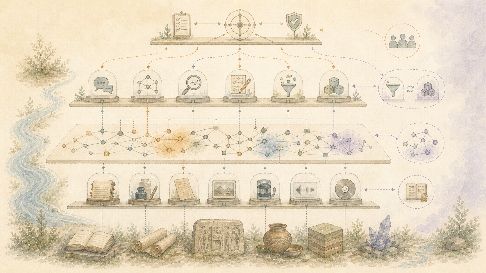

> 简体中文: 权威英文源的机器辅助翻译。欢迎母语更正。 [英语](../../README.md) | [所有语言](../README.md)

# 系统如何结合在一起



## 职责分离

该平台将四个关注点分开，这些关注点相互合作但不会相互融合：

一. **保存**保留原始证据和观察到的出处。
二. **理解**添加版本化语义对象、关系、时间状态，
  以及支持的解释。
三. **检索和交互**收集针对问题的请求特定证据，
  探索、对话。
四. **工件重建**将有界证据世界转换为声明的世界
  已声明接收者的产品。

产品说明不会向后泄漏到语料库真相中。章节、读者、流派、修辞手法或文字预算都属于一次撤回。它不是源工件上的固有标签。

## 分层拓扑

```text
PRIMARY EVIDENCE
  immutable artifacts, interaction events, source identity, observed arrival
        |
        v
VERSIONED REPRESENTATIONS
  extracted text, media observations, chunks, entities, embeddings, locators
        |
        v
SEMANTIC AND TEMPORAL MAPS
  propositions, discourse links, argument edges, chronology, supersession,
  uncertainty, open attachment points, Personal Meaning Matrix contributions
        |
        +---------------------------+
        |                           |
        v                           v
INTERACTIVE CONTEXT             ARTIFACT CONTRACT
  request-scoped traversal        receiver, purpose, form, budget, evidence rules
        |                           |
        |                           v
        |                       REVERSE EXPANSION
        |                           |
        |                       WHOLE-TREE COLLAPSE
        |                           |
        |                       FORWARD RECONSTRUCTION
        |                           |
        +----------------------> HUMAN PROTOCOL + WEAVE
                                    |
                                INDEPENDENT GATES
                                    |
                              RECEIPT-GATED PRODUCT
```

## 加入并不假装知道

到达记录可以表明特定字节通过特定通道到达系统。它不会默默地决定谁创建了该工件、谁出现在其中、其主题何时出现、文件名是否准确、它为何重要或谁拥有其内容。这些是具有不同证据和权威的单独观察。

该架构将原始工件与源自它的表示区分开来。提取的文本、描述、嵌入、分类、摘要和关系可以重新生成或取代。它们不会取代源。

## 交互和文档路径

交互式回答和工件生成共享证据、出处、类型化关系、不确定性和验证机制。它们与相同的工作流程仍然不同。

交互式请求可能需要完整的对话、任务生命周期、窄关系遍历或澄清。它不需要构建一个书籍容器并全局折叠一棵历史树。

工件生成确实需要声明的产品、接收者、预算和整个工件计划。它必须在修剪之前查看相关的临时结构，并且必须考虑遗漏的内容。

## 动态架构而非固定链

装配线是为产品而编制的。不同的输出可以使用不同的专家，以不同的方式订购相同的专家，或者需要一种功能的多个实例。经理使用能力合同和先前的证据，而不是单独使用硬编码的舞台名称。

通用不变量在每一条线上都保持稳定：源身份、所有权、认知状态、不确定性、损失核算、类型切换、成本观察、独立验证和回滚。

当外部通用模型的测量贡献证明切换合理时，它可以占用一个类型站。它仅接收该站所需的请求范围的有效负载，而不接收维护的语料库或更广泛的控制平面编码的权限。更换或移除该站可以使持久记录和未来重建能力完好无损。有界站可以在不接收人类知识的情况下做出贡献，否则中心化系统就会变成制度价值。
